### AWS STORAGE SERVICES

### Simple Storage Services (S3)

#### Glacier

- Versão mais barata de armazenamento.
- Utilizado para manter dados por muito tempo.
- Não é acessivel tão facilmente como S3, deve ser utilizado para arquivamento de arquivos.
- É possível criar rotinas de envio de dados do S3 para Glacier.

#### Elastic Block Store (EBS)
- Alta disponibilidade, baixa latência armazenamento.
- Especificamente utilizado para anexar em conjunto com serviços em EC2.
- Similar ao anexar um HD a um computador.

#### Elastic File System (EFS)
- Network attached storage service, especificamente para serviços EC2.
- Por ser um serviço de armazenamento em rede, permite multiplos serviços acessar em um único datasource
- Similar com um NAS, onde vários serviços/dispositivos podem acessar um storage na rede de casa.

#### Storage Gateway
- Permite armazenamento híbrido entre ambientes locais e cloud da AWS.
- Tem baixa latência armazenando em cache dados usados com frequência

#### Snowball
	- Portátil, petabyte scale data storage, pode ser utilizado para migrar dados e grande volume de dados de on-premise ambiente até a aws cloud.
	- Simplesmente é preciso fazer download dos dados para o "snowball device", então enviar para AWS, que irá então fazer upload de dados para AWS storage service para você.


### Cloud Computing Models

### Infrastructure as a Service (IaaS)
- Contém a estrutura básica para Cloud IT
- VCP, EC2, EBS

### Platform as a Service (PaaS)
- AWS gerencia camada por baixo da infra (normalmente hardware e sistema operacional)
- RDS, EMR, ElasticSearch

### Software as a Service (SaaS)
- Produto completo que roda e é gerenciado pelo provedor de serviço. Normalmente se refere a aplicações de usuário final.
- Normalmente roda em navegador, email, Office363, Sallesforce.com


### Serverless Computing
- Permite criar e rodar aplicações sem pensar em servidores.
- Também referenciado como **Function-as-a-Service (FaaS)

Exemplos:
- Amazon Simple Storage Service (S3)
- AWS Lambda
- Amazon DynamoDB
- Amazon SNS

## AWS Database Services

### Relational Database (RDS)
- Serviço auto gerenciado
- MySQL, MariaDB, Amazon (versãoa própria de mySQL) Amazon Aurora, Standard Postgre, Amazon Aurora PostgreSQL, Microsoft SQL Server e Oracle.

### No SQL
- DynamoDB
- Redshift (utilizado para bigdata)
- ElasticCache: in-memory data store/cache.

### Diversos
- Database Migration Services (DMS): orquestra migração de databases através da AWS. Permite migrar dados de um tipo de banco para outro. Ex: (oracle => aurora)
- Amazon Neptune: Banco de dados em gráfo:  Alta performance, graph database, otimizado para salvar bilhões de relacionamentos e buscando informações do gráfo com latência de milissegundos.


#### Intro to Databases Services
- Criação de uma instância mysql na aws

#### Intro to Compute and Networking Services
- Elastic Compute Cloud (EC2):

	Provê serviços virtuais na cloud aws. É possível subir uma ou milhares de instâncias simultaneamente e só ser cobrado pela utilização.

- EC2 Autoscaling:

	Permite dinamicamente aumentar e diminuir capacidade de ec2 baseado em condições pré-definidas.

- Amazon Lightsail

	Maneira mais simples de lançar serviços virtuais rodando aplicações na aws.
	AWS vai prover tudo necessário, manutenção de DNS, STORAGE.

- Elastic Container Service (ECS)

	Alta escalabilidade e alta performance, serviço de gerenciamento de containeres para docker.
	Containers vão rodar em cluster gerenciado de instancias ec2.

- AWS Lambda

	Serviço que permite rodar código na cloud da AWS, removendo a preocupação em gerenciar serviços.
	Só subir código e aws vai se encarregar de rodar.

#### Exemplo 1 webserver utilizando autoscaling e LoadBalancer


### Intro to Networking & Content Delivery
- CloudFront:

	Clobal Content Delivery (CDN)
	Entrega com segurança conteúdo requisitado com frequência sobre mais de 100 pontos do globo e fazendo isso alcaça baixa latência e alta velocidade de transferência para usuários finais. Também provê proteção contra ataques **DDoS**

- Virtual Private Cloud (VPC)

	Permite isolamento lógico na cloud AWS. Dessa forma é possível subir serviços na rede virtual. Este é um espaço privado próprio na AWS. Ninguém de fora tem acesso (a não ser que seja permitido).

- Direct Connect

	Rede dedicada de alta velocidade com AWS. Empresas podem utilizar para estabelecer conexão privada com a cloud da aws em situações onde a conexão normal não seja adequada.

- Elastic Load Balancing (ELB)

	Distribui requisições de entrada automaticamente entre múltiplas instấncias ec2 e também em múltiplas zonas disponíveis. Então se uma zona disponível cair o tráfego será redirecionado para outra zona e a aplicação continua entregando respostas a requisições. Tabmém permite alcançar alta disponibilidade e tolerência a falhas com a distribuição do tráfego sobre as instâncias e ignora instâncias com problema.

- Amazon 53

	Nome de domínio (DNS) com alta disponibilidade e escalável. Pode direcionar tráfego para nome de domínio e direcionar esse tráfego para backend web-server.

- API Gateway

	Serviço gerenciado que facilita para desenvolvedores criar e disponibilizar APIS seguras em qualquer escala. Pode lidar com todas tarefas envolvendo aceitar e processar milhares ou milhões de chamadas concorrentes a API. É serverless, não é preciso se preocupar com infra.

#### Exemplo de network services


### AWS Management Tools
- CloudFormation:

	- Provisionar
	- Monitoramento e Logs
	- Administração de operações
	- Administração de configurações
	Permite que através de arquivo texto seja definida a infra.

- AWS Service Cataglog

	Permite que empresas cataloguem recursos que podem ser deployados na cloud aws. Isso permite que empresas
	consigam regras governamentais e conformidades para recursos de TI com uma definição clara do que pode ser deployado na aws.

- CloudWatch

	É um serviço de monitoramento para recursos da aws e aplicações que so deployadas na aws cloud. Pode ser utilizado para acionamentos de operações de escala e para prover clareza dos recursos deployados.

- AWS Systems Manager

	Provê uma interface de usuário unificada que permite visualizar dados operacionais de multiplos serviços AWS e automatizar tarefas através de recursos AWS. Isso reduz o tempo de detectar e resolver problemas operacionais.

- AWS CloudTrail

	Monitora e registra atividades de contas AWS incluindo ações tomadas através do AWS management Console, AWS software development kits, command-line tools e outros serviços. Então isso simplifica muito análises de  atividades de segurnça de usuários da conta.

- AWS Config

	Permite que acesse, audite e avalie configurações de recursos AWS. Isso simplifica auditoria, análise de segurança, gerenciamento de mudanças e controla e também resolução de problemas operacionais.

- OpsWorks

	Provê gerenciamento de instâncias de CHEF and PUPPET. Chef e Puppet podem ser usados para configurar e automatizar deployment de recursos.

- Trusted Advisor

	Experiente sistema online que analisa sua conta AWS e recursos de dentro e avisa você como conseguir alta segurança e melhor performance dos recursos.


#### Exemplo de notificação


### Application Integration
- Step Functions:

	Torna fácil coordenar componentes de aplicações distribuidas e microserviços utilizando um workflow visual. É criado uma série de steps visuais onde é possível definir o fluxo de trabalho e o que executa antes de o que ou se funções devem executar em paralelo.

- Simple WorkFlow Service (SWF)

	Trabalha de forma similar à Step Functions em coordenar múltiplios componentes sobre um processo. É mais recomendado utilizar Step Functions ao invés de SWF.

- Simple Notification Service (SNS)

	Serviço de comunicação (PUB-SUB) gerenciado pela aws. É possível criar um tópico e utilizar subscribers para esse tópico e quando for publicado mensagem naquele tópico os inscritos vão receber a notificação. Pode ser utilizado p/ push notifications em dispositivos mobile.

- Simple Queue Service (SQS)

	Serviço gerenciado para filas de mensagens. Torna fácil desacoplar aplicações.

#### Exemplo de desacoplamento de aplicação com fila e auto-scalling


### Customer Engagement
- Amazon Connect:

	Permite através de interface gráfica (arrastar e soltar) criar um fluxo de processo que define interações de cliente sem ter nada de codificação.

- Amazon Pinpoint:

	Envia e-mail, sms e push para alvos de marketing. Campanhas e mensagens diretas para clientes individualmente por ex. uma confirmação de compra.

- Simple Email Service (SES):

	Envio de e-mail em massa. Para uma conta estar apta no envio em massa é necessário solicitar á amazon liberação do sandbox. Deve ser feito um pedido direto na conta. https://docs.aws.amazon.com/ses/latest/DeveloperGuide/request-production-access.html


### Analytics
- Amazon Elastic MapReduce (EMR):

	AWS Hadoop framework como um serviço. É possível rodar outros frameworks no Amazon EMR que integra com Hadoop como **Apache Spark, HBase Presto e Flink**. Dados podem ser analisados por EMR em um número de fonte de dados que inclui S3 e DynamoDB.

- Amazon Athena:

	Permite analisar dados salvos direto no s3 usando consultas SQL.

- Amazon ElasticSearch Service:

	Serviço completamente gerenciado para elasic.com elasticsearch framework. Permite alta velocidade buscado e analisando dados salvos na aws.

- Kinesis:

	Permite coletar e processar dados de streaming em realtime.

- QuickSight:

	Business intelligence (BI) gerador de relatório, similar ao tableau. Serviço completamente gerenciado.


### Machine Learning
- DeepLens:

	Câmera Video profundo para estudos com kit de desenvolvimento que permite a criação de aplicações visuais avançadas.

- SageMaker:

	Permite construir e treinar modelos próprios de aprendizado de máquina e disponibilizar na cloud AWS para então utilizar no backend de aplicações.

- Rekognition:

	Prove aprendizado profundo baseado em análise de video e imagens.

- Amaxon Lex:

	Permite a construção de bots de chat conversacional, estes podem ser utilizados em muitas aplicações como primeira linha de contato para clientes.

- Amazon Polly:

	Prove sons naturais de texto para fala..

- Comprehend:

	Pode usar deep learning para analisar texto para insights e relacionamentos. Isto pode ser usado para análise de clientes ou busca avançada de documentos.

- Tranlate:

	Pode usar estudos de máquina para precisamente traduzir texto para um número diferente de linguas.

- Transcribe:

	Sistema de reconhecimento automático de falas que pode analisar arquivos de áudio que são salvos no s3 e retornar o texto transcrito.


### Security, Identity & Compliance
- AWS Artifact:

	Portal online que prove documentos sobre acesso à segurança e conformidade AWS documentação e essa documentação está prontamente disponível quando necessrio para fins de auditoria e conformidade.

- AWS Certificate Manager:

	Requisita certificados ssl para comunicação `HTTPS` com site e integra em serviços AWS como ****ROUTE 53** e **CloudFront** e os certificados providos através do gerenciador de certificados são completamente **sem custo**.

- AWS Cloud directory:

	Serviço de diretorório em núvem que pode ter dados hierárquicos em múltiplas dimensões diferente de diretório convencial baseado em **LDAP** que podem ter somente uma hierarquia.

- AWS Directory Service:

	Diretório ativo microsoft é um serviço completamente gerenciado.

- CloudHSM:

	Módulo dedicado de segurança na cloud aws permite alcançar conformidade corporativa e regulamenttos enquanto ao mesmo tempo reduzindo significativamente custos sobre utilizar um HSM em uma infra própria.

- Cognito:

	Prove habilidades de login e cadastro para aplicações web e mobile também permite integrar o processo de cadastro com provedores externos como Google e Facebook e também SAML 2.

- Identity and Access Management (IAM):

	Permite gerenciar acesso de usuário para recursos e serviços aws de uma conta, usuários e grupos de usuários tem permissões individuais que permitem ou negam acesso a recursos

- AWS Organizations:

	Prove gerenciamento de politicas de privacidade para multiplas contas aws. É bom para grandes organizações que tem muitas contas e eles querem gerenciar contas de usuários centralizadamente na amazon.

- Amazon Inspector:

	Serviço automatizado de avaliação de segurança, pode ajudar a encontrar falhas ou áreas para melhorar em uma conta aws.

	- Assistente de segurança automático
	- Reduz custo e aumenta efetividade de assistência e conformidade
	- Preço inicia em $ 0.30 por agente-assistente por mês utilizando desconto de volume é possível atingir um valor mímino de $ 0.05 por agente-assistente por mês.


- Key Management Service (KMS):

	Torna fácil criar e controlar chaves criptográficas para dados criptografados também usa módulos de segurança de hardware para  suas chaves Tem boa integração com serviços como: S3, Redshift e EBS.

- AWS Shield:

	Prove proteção contra negação de serviço distribuido (DDoS). Versão padrão de proteção é implementado automaticamente em todas contas aws.

- Web Application Firewall (WAF):

	Firewall aplicação web que fica na frente de website para prover proteção adicional contra ataques comuns de **SQL INJECTION** e **cross-site scripting**. Tem diferentes conjunto de regras que podem ser usados em diferentes aplicações.


### AWS Developer Tools
- Cloud 9:

	Ambiente de desenvolvimento integrado (IDE) rodando na cloud aws que permite fazer deploy de servidores diretamente para aws de IDE.

- CodeStar:

	Torna fácil desenvolver e disponibilizar aplicações na aws pode gerenciar todo pipeline de CI/CD. Tem um gerenciador de projetos incluindo issue tracking provido por Atlassian JIRA Software.

- X-Ray:

	Torna fácil analisar e debugar aplicações isto permite um melhor entendimento de performance da aplicação e serviços ligados.

- CodeCommit:

	É um repositório git parecido com github e está rodando na cloud aws.

- CodePipeline:

	É integração e distribuição contínua (CI/CD). Pode criar o build, testar e deployar cada vez que o código é modificado.

- CodeBuild:

	Compila código fonte, roda testes e produz pacotes de software que estão prontos para ser deployados na aws.

- CodeDeploy:

	Serviço que automatiza disponibilização de software para uma variedade de serviços computacionais incluindo: **ec2, AWS lambda** e até instấncias que estão rodando localmente.


### AWS Media Services
- Elemental MediaConvert:

	É um serviço de transcodificação video baseado em texto para converter formatos de video sob demanda.

- Elemental MediaPackage:

	Prepara conteúdos de video para distribuição através da internet também  protege contra privacidade através de gerenciamento de direitos autorais.

- Elemental MediaTailor:

	Insere individualmente propagandas personalizadas em conteúdos de video

- Elemental MediaLive:

	Serviço de video ao vivo para transmissão de vídeo na internet.

- Elemental MediaStore:

	Serviço de armazenamento na cloud aws otimizado para multimídia.

- Kinesis Video Streams:

	Transmissão de videos de dispositivos conectados através da cloud aws para análise e estudos de máquina e outras aplicações de processamento.


### Mobile Services
- AWS Mobile Hub:

	Permite facilmente configurar serviços aws para dispositivos mobile em um lugar este gera cloud configuração que salva informação sobre os serviços configurados.

- AWS Device Farm:

	É um serviço de testes para (iOS, Android e web-apps) permite testar aplicativo contra uma grande coleção de dispositivos físicosna cloud aws.

- AWS AppSync

	GraphQL backend para dispositivos móveis e aplicações web.


### AWS Migration Services
- AWS Application Discovery Service:

	O serviço de descoberta de aplicativos reúne informações sobre a empresa data centers locais para ajudar a migração para os dados aws, dados são retidos em um formato criptografado em um serviço de discoberta.

- AWS Database Migration Service:

	Orquestra a migração de bancos de dados através da cloud aws também permite a migração de de um tipo de banco para outro totalmente diferente: Ex migrar Oracle  para AWS Aurora.

- AWS Server Migration Service:

	Pode automatizar a migração de milhares de cargas de trabalho locais para cloud aws reduzindo custos e minimiza tempo e inatividade para migrações.

- AWS Snowball:

	Dispositivo portátil de armazenamento extensível petabyte pode ser usado para migração de ambientes locais para cloud aws.

### Business Productivity & App Streaming
- Amazon WorkDocs:

	Serviço completamente gerenciado seguro de colaboração e gerenciamento de arquivos na cloud aws. O cliente web permite visualizar e comentar em mais de 35 tipos de arquivo diferente inluindo microsoft office e pdf.

- Amazon WorkMail:

	Serviço seguro gerenciado email e calendário empresarial.

- Amazon Chime:

	Serviço de conferência Online, bom para empresas, reuniões online, video conferências, chamadas e compartilhamento de conteúdo de dentro e fora da empresa.

- Amazon WorkSpaces:

	Serviço completamente gerenciado seguro "desktop as service" pode de maneira fácil ter um desktop windows ou linux.

- Amazon AppStream 2.0:

	Serviço de transmissão completamente gerenciado permite a transmissão de desktops aws para navegador compatível com html5, é bom para usurios que querem acessar suas aplicações de qualquer lugar.


### Internet of Things (IoT)
- AWS IOT:

	Plataforma gerenciada na nuvem que permite embutir dispositivos como microcontroladores e Raspberry Pi, para com segurnaça interagir com a nuvem.

-  Amazon FreeRTOS:

	Sistema operacional para microcontroladores como o microhip pic32 que permite dispositivos de baixo custo e baixa energia conectar com aws IoT.

-  AWS Greengras:

	Software que permite rodar localmente funções aws lambda e sincronização e armazenamento em cache de dados de mensagens de aplicações de machine learning em dispositivos conectados IoT.


### Game Development
- Amazon Gamelift:

	Permite gerenciar, extender e disponibilizar servidores dedicados na cloud aws.

- Amazon Lumberyard:

	Ambiente de desenvolvimento de jogos e multiplataforma triple-a engine na cloud aws.


## AWS Command LIne Interface (cli)
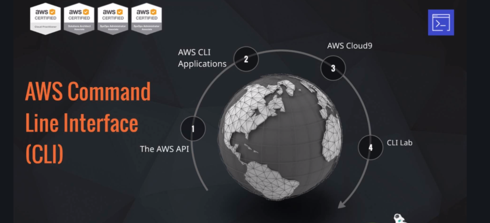


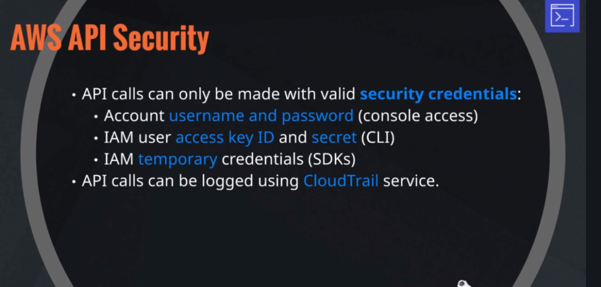


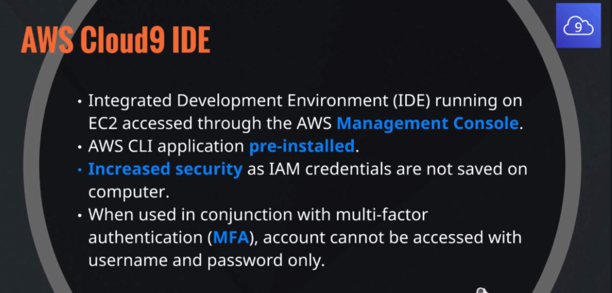


## CLI Lab
- Criar ambiente Cloud9
- Criar bucket s3 usando linha de comando
- Upload e delete de objeto
- Remoção de bucket


### Elastic Beanstalk
Serviço de deploy que permite disponibilizar aplicações para arquiteturas complexas na aws sem ter que se preocupar sobre a camada por trás.

- Laucnhed in 2011
- Quichly deploy and manage applications on environments
- Automatically handles **capacity** provisioning, **load balancing, scaling**, and application **helth monitoring.**
- New versions can be uploaded through the **console** or **CLI** and, environment re-deployed.

	- Applications can be:

		- Docker Containers
		- NodeJS, Java, .NET, PHP, Ruby, Python & Go.
		- On servers such as Apache, Nginx, Passenger, and IIS.

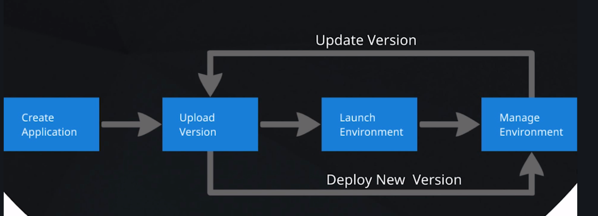

### O que é uma arquitetura de alta disponibilidate e tolerante a falhas ?


#### Deployment options:

- All at once,
- Rolling (a batch at a time), Rolling with additional batch,
- Immutable (two environments temporarily),
- Blue - Green (two environments).


### Business Case for AWS

#### 6 Vantagens da computação em nuvem
- Troca de custo alto por custo variável
- Benefícios de grande economia de escala
- Parar de adivinhar capacidades
- Aumentar velocidade e agilidade
- Parar de gastar dinheiro rodando e mantendo servidores
- Ser global em minutos

### AWS Compliance Program

- Cobre uma grande variedade de certificações, leis e regulações e frameworks que aws está em conformidade ou pode ajudar para ter conformidade em.


### AWS Artifact

- Repositório central de informações relacionadas conformidades.
- Acesso sob demanda para segurança e relatórios de conformidade e seleção online de acordos ex:
	- Service Organization Control (SOC)
	- Payment Card Industry (PCI)
- Acessado através do AWS Management Console


### AWS Architecture and Compliance

- O centro de arquitetura AWS provê uma coleção de recursos técnicos para ajudar a construir mais eficaz e eficiente na cloud aws. https://aws.amazon.com/architecture

- AWS Well-Architected: https://aws.amazon.com/architecture/well-architected/
- Compliance: https://aws.amazon.com/compliance


### Entregando websites HTML5 a prova de balas com Amazon Web Services
- Comprar um nome de domínio (através de Route53)
- Upload site aws s3
- Ativar s3 hospedagem de site
- Encriptação HTTP/SSL
- Roteamento de tráfego com Route 53
- Criar uma distribuição CloudFront

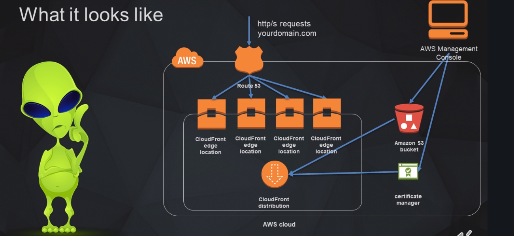

### Steps para liberar um site para ser público no S3

- 1 Criar um bucket para o site (melhor nomenclatura do bucket próprio domínio) [Console](https://s3.console.aws.amazon.com/s3/home?region=us-east-1)

	- 1.1 Desmarcar opção para bloquear todo conteúdo.
		- 1.1.2 Copirar código (ARN) do bucket
	- 1.2 Entrar nas configurações do bucket **Permissions** e depois **Bucket Policy**
	- 1.3 Gerar políticas de privacidade. [link](https://awspolicygen.s3.amazonaws.com/policygen.html)

		- 1.3.1 Select type of policy => S3 Bucket Policy
		- 1.3.2 Principal => *
		- 1.3.3 AWS Service S3
		- 1.3.4 Actions => GetObject
		- 1.3.5 Colar o código (ARN) e adicionar **/\*** para permitir acesso a tudo após raiz
		- 1.3.6 Add Statement
		- 1.3.7 Add Generate Policy
		- 1.3.8 Copiar json de policy gerado e colar na tela aberta no step **1.2** e salvar.

		OBS: Deverá mostrar a msg: **This bucket has public access**
- 2 Fazer upload dos arquivos estáticos para o s3

	- 2.1 Na aba de permissões deixar acesso de leitura público
	- 2.2 Storage class => Standard

- 3 Permitir que bucket seja utilizado como website estático
	- 3.1 Properties => Static website hosting, **Use this bucket to host a website** e informar o nome do arquivo index.

### Criação de certificados SSL com Certificate Manager

- 1 Acessar [Console](https://console.aws.amazon.com/acm/home?region=us-east-1#/firstrun/)
- 2 Provision certificates => Get started

	- 2.1 Rquest a public certificate => Request a certificate

	Colocando **\*.DOMAIN..** todos os subdomínios vão ter o certificado também.

	

	- 2.2 Escolher opção DSN VALIDATION

	- 2.3 Adicionar CNAME no provedor de dns

	

### Criação de CloudFront Distribution
- Com ele conteúdo estático de site estará disponível em diversos pontos estratégicos espalhados pelo globo, fazendo com que requests ao conteúdo sejam disponibilizadas do local mais próximo aumentado a velocidade.
- Reduz custos, pois conteúdo solicitado vai ser menos requisitado do s3.
- Também provê alguns adicionais de segurança (DDoS).
- Acessar [Console](https://console.aws.amazon.com/cloudfront/home?region=us-east-1#)
- Criar uma distribuição

	

	- Origin Domain Name => mesmo do bucket
	- Origin Path => não precisa
	#### Default Cache Behavior Settings
	- Redirect HTTP to HTTPS

	#### Distribution Settings
	- Alternate Domain Names (CNAMES) => informar **domínio** e o **www** ex:

			coddare.com.br
			www.coddare.com.br

	- SSL Certificate => Custom SSL Certificate, selecionar o certificado criado

	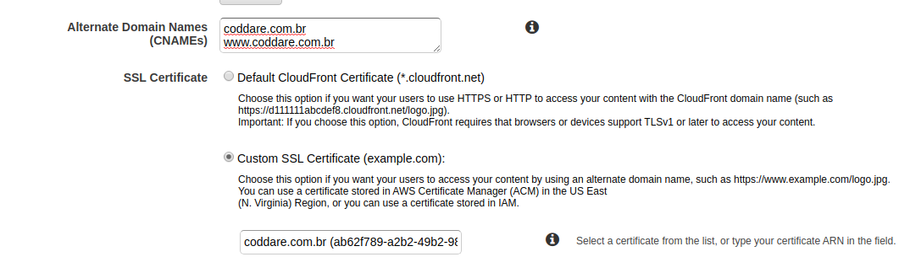

	- Default Root Object => index.html

	- Enable IPv6 => desativado (não necessário)
	- Comment => nome do domínio => coddare.com.br
	- Salvar e Aguardar .. demora cerca de 30 min.
	- Após liberação e replicação para todos os **edge locations**, é necessário garantir que
	ROUTE 53 está sendo redirecionado para o CloudFront distribution

### Redirecionamento com Route 53
- Acessar [Console](https://console.aws.amazon.com/route53/home?region=us-east-1)
- Create Record Set

	
- Deve ser criado outro Record set para o **www**

	- Type => CNAME Canonical name
	- Alias => False
	- Alinas Value (cloud front dns)

- Existe um site para verificar a propagação do dns acessar através do [Link](https://www.whatsmydns.net/)

### Invalidar dados no CloudFront
- Como CloudFront tem um ttl de 24 horas, caso novo conteúdo seja disponibilizado, não será atualizado até que esse tempo passe, caso seja necessário, deve ser invalidado CloudFront.
- Ir na distribuição => Inalidations

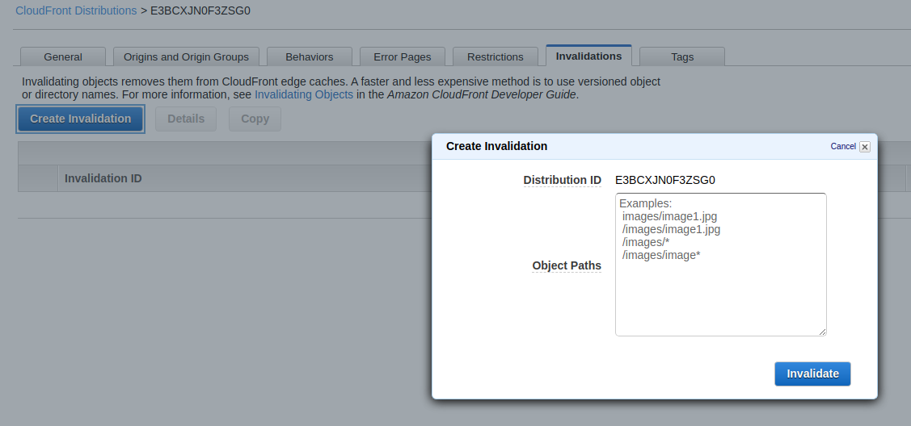

- É possível invalidar arquivos específicos ou todo conteúdo Ex:

		index.html
		images/*

### Redirecionamento de vários domínios para um só

	- coddare.com
	- coddare.net
	- coddare.tech

Fazer todos serem redirecionados para: `coddare.com.br`

No bucket criado na parte de wetbsite hosting **Adicionar Redirect requets**


### IAM, Organizations E CloudTrail

- AWS Security Shared Responsibility


#### What is IAM ?

- A **web service** that allows you to securely control individual and group access to your AWS resources.
- Create and manage user identities ("**IAM users**") and grant permissions.
- Features

	- **Shared access** to your AWS account
	- **Granular** permissions
	- Secure access to AWS resources for applications that run on **Amazon EC2**
	- **Identity federation** to grant permissions for users outside of AWS
	- Payment Card Industry (**PCI**) Data Security Standard (**DDS**) Compliance
	- Access log auditing using **CloudTrail**
	- **Eventually** Consistent
	- **Free** to use

#### Users

- Represent person or service acessing your account
- Consists of a **name** and **credentials**
- Users are identified by:

	- A "**friendly name**" eg: **"Bil"**
	- Amazon Resource Name (**ARN**)

			arm:aws:iam::acccount-ID-withoud-hyphens:user/Bill

	- **Unique Identifier** which is returned only when you use the API, SDKs, Tools for Windows PowerShell, or AWS CLI to create the user.

- Credentials can be associated to a user:

	- **Console password.** User will have aurl link to login to the console.
	- **Access keys** (access key ID and a secret key), max 2.

- **Never use root user** to access resources unless absolutely essentials. Create admin users with required permissions. Always enable multi-factor authentication of the root user.


#### User password Policies
- You can use a password policy to do these things:

	- Set a minimum password length
	- Require specific character types.
	- Allow all IAM users to change their own passwords.
	- Password expiration.
	- Prevent users from resusing previous passwords.
	- Force users to contact an account administrator when the password expired.


## Groups
- **Collection** of IAM users.
- Users **assume** the permissions of the group.
- Users can belong to **multiple groups**
- Groups can only contain users, **cannot be nested**.

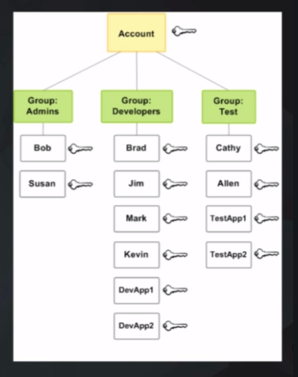


## Roles
- Defined permissions that can be assumed by **users or resources**.
- Allow **EC2 instances** to access other AWS resources.
- Grant access to your resources to users in **another AWS account**
- Can be used to allow users to temporarily assume a role with least privilege access to critial resources.
**Identity federation** using:

	- AWS Cognito
	- OAUTH (Facebook, Google eeet)
	- Enterprise Single Sign On with LDAP or Active Directory

## AWS Organisations
- Allows multiple AWS accounts used by an organisation to be part of an **Organisational Unit** (OU)
- **Service Control Policies** (SCPs) allow the whitelisting or blacklisting of service within an Organisational Unit.
- A **blacklisted** service will not be available even if the IAM user or group policy allows it.
- Benefits:

	- **Centrally manage** policies across multiple AWS accounts
	- **Control access** to AWS services
	- **Automate** AWS account creation and management programmatically with APIs
	- **Consolidate billing** across multiple AWS accounts

	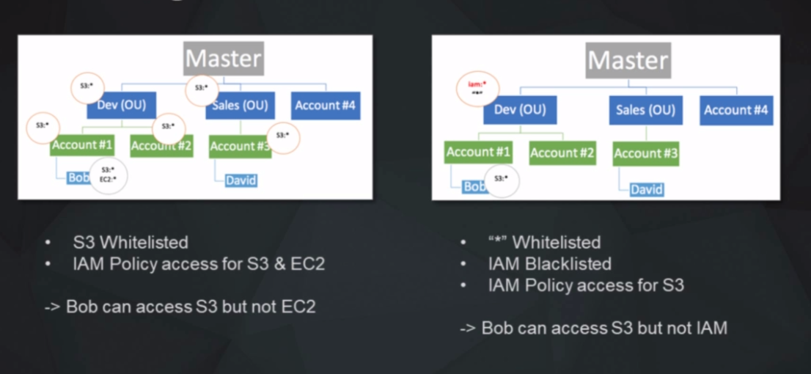

## IAM Policies
 - By default, users cant't access anything in your account
 - Grant permissions through **policies** that define the effect, actions, resources, and optional conditions.

	```json
	{
		"Version": "2012-10-17",
		"Statement": {
			"Effect": "Allow",
			"Action": "dynamodb:*",
			"Resource": "arn:aws:dynamodb:us-west-2:123456789012:table/Books",
		}
	}
	```

#### Amazon Resource Names (ARN)
The access policy language requires you to specify the resource or resources using the following Amazon Resource Name (ARN) format:

		arn:aws:iam::account:resource (note region missing)

Examples:

An IAM user in the account: `arn:aws:iam::123456789012:user/Bob`

An IAM group: `arn:aws:iam::123456789012:group/Developers`

An IAM role: `arn:aws:iam::123456789012:role/S3Access`

An instance profile that can be associated with an EC2 instance: `arn:aws:iam::123456789012:instance-profile/Webserver`

A federated user identified an IAM as "Bob": `arn:aws:sts::123456789012:federated-user/Bob`


### User-Based vs Resource Based Policies
- IAM policies (resource-level) are attached to a user, group or role and specify the actions that are permitted and the resource (EC2 instance, RDS database, etc.) that can be accessed.
- Resource-Based policies (as opossed to IAM policies) are attached to a resource and only available for:

	- Amazon S3 buckets (bucket policies and ACLs),
	- Amazon Glacier valults (vault access policies),
	- Amazon SNS topics,
	- Amazon SQL queues, and
	- AWS Key Management Service encryption keys.

### Identity Federation
- An IAM role can be used to specify permissions for externally identified (federated) users.
- Max 5000 IAM users per account. Identity federation enables unlimited temporary credentials.
- Identified by your organization or third-party identity provider
- Methods of federating users:

	- Amazon Cognito (developer authenticated identities, guest access or public identity service provider).
	- Public identity Service Providers or OpenID Connect (Facebook, Goole, Amazon etc.)
	- Identity provider software package that supports SAML 2.0 (Security Assertion Markup Language 2.0).
	- Creating a custom identity broker application that authenticates users (eg. with the enterprise's LDAP or Active Directory service). The application then assumes temporary credentials for the user.
	- AWS Directory Service for Active Directory and use this for enterprise AWS access.


### AWS CloudTrail
- AWS Management Console, SDK and CLI all use the **AWS API** to communicate to AWS services.
- AWS can **log calls** to AWS services from the AWS API.
- Logs are stored in a **bucket** and can be analysed (Amazon Athena, EMR etc).
- **SNS topic** can alert security issues.

### IAM Best Practices
- Lock Away Your AWS Account **Root User Access Keys**
- Create Individual **IAM Users**
- Use **Groups** to Assingn Permissions to IAM Users
- Use **AWS Defined Policies** to Assign Permissions Whenever Possible
- Grant **Least Privilege**
- Use **Access Levels** to Review IAM Permissions (List, Read, Write, or Permissions management).
- Configure a Strong **Password Policy** for Your Users
- Enable **Multi-Factor Authentication (MFA)** for Privileged Users
- Delegate by Using **Roles** Instead of by Sharing Credentials
- Use **Roles for Applications** That Run on Amazon EC2 Instances
- **Rotate Credentials** Regulary
- Remove **Unnecessary Credentials**
- Use **Policy Conditions** for Extra Security (eg MFA login)
- **Monitor** Activity in Your AWS account (eg CloudTrail)


### Identity and Access Management (IAM) Core knowledge
- Não é necessário colocar permissões direto no usuário, quando for fazer o vínculo entre grupo e usuário, ele herdará as permissões do grupo.

- Para alterações nas políticas de conta acessar [link](https://console.aws.amazon.com/iam/home?region=us-east-1#/account_settings).


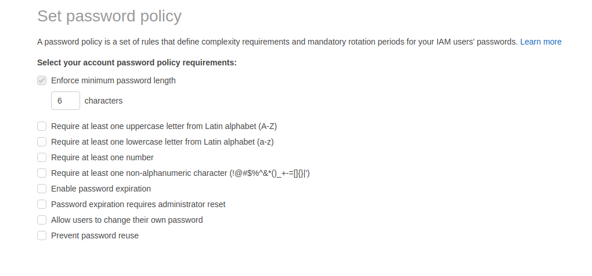


### Criação de regras de acesso
- [Console](https://console.aws.amazon.com/iam/home?region=us-east-1#/roles)
- Criação de uma role para ec2 ter comunicação com **CloudWatch**

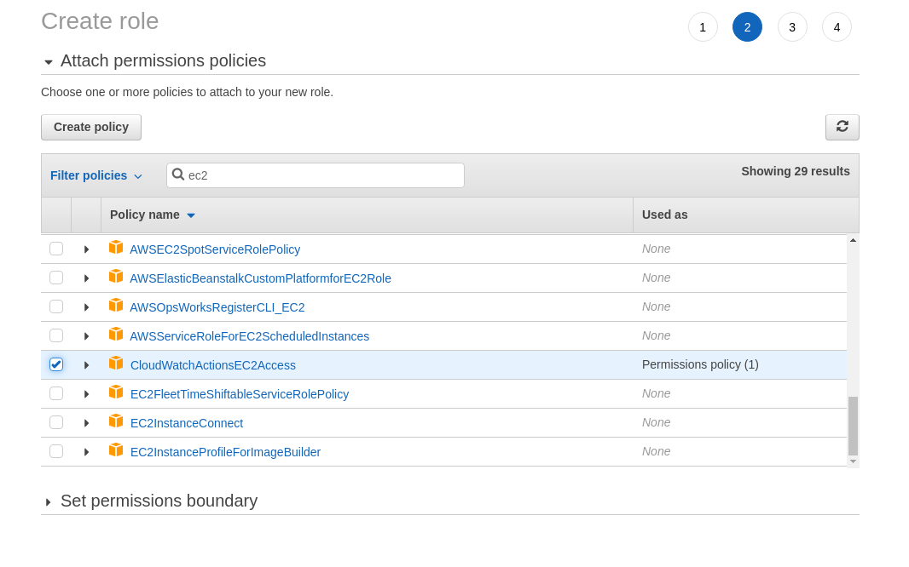

- Alterar alias do account (Dashboard)


### Credential Report


### Trusted Adviser
- Serviço de verificação e otimização para diversas áreas/serviços

	- Coast Optimization
	- Performance
	- Security
	- Fault Tolerance
	- Service Limits

- Com base no plano existem diferentes coberturas no serviço.


## EC2 Elastic Cloud

###  EC2 Purchasing Options
- **On-Demand Instances**
	- Pay, by the second with no up-front or terminating costs.

- **Spot Instances**
	- Request unused EC2 instances, which can lower your Amazon EC2 costs significantly. Generally cheapest option although not always.
	- **Maximum price** that you are willing to pay per hour per instance.
	- **AWS can interrupt** them when needed (Spot Instance interruption) or when spot price exceeds your max price.
	- If your Spot instance is terminated or stopped by Amazon EC2 in the first instance hour, you will not be charged for that usage. Otherwise charged to the nearest second.

- **Reserved Instances**
	- Purchase, at a significant discount, instances that are always available, for a term from one to three years.

- **Scheduled Instances**
	- Purchase instances that are always available on the specified recurring schedule, for a one-year term.

- **On Demand Capacity Reservations**
	- Reserver Capacity for your EC2 instances in a specific Availability Zone for any duration.

- **Dedicated Instances**
	- Pay, by the hour, for instances that run on single-tenant hardware.

- **Dedicated Hosts**
	- Pay for a physical host that is fully dedicated to runnning your instances.

###  EC2 Saving Plans
- Reduced pricing in exchange for consistent usage ($/hr) over **1 or 3 year** commitment.
- AWS **Cost Explorer** recommendations are used as basis for savings plan.

	- **Compute** Saving Plans:

		- Most flexible, applied to **all** instance types, size, operating system or tenancy.
		- Up to 66 percent off On-Demand rates

	- **EC2 Intance** Saving Plans:

		- Applied to individual **instance family** in a **region**
		- Up to 72 percent off On-Demand rates

- Payment Options:

	- **No Upfront** (monthly basis)
	- **Partil Upfront** - lower price
	- **All Upfront** (one payment) - lowest price

- Does not provide capacity reservations.

#### EC2 Instance Reserving Options


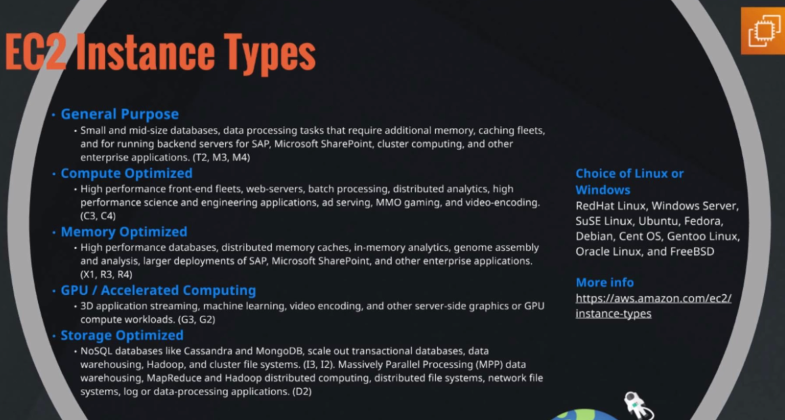


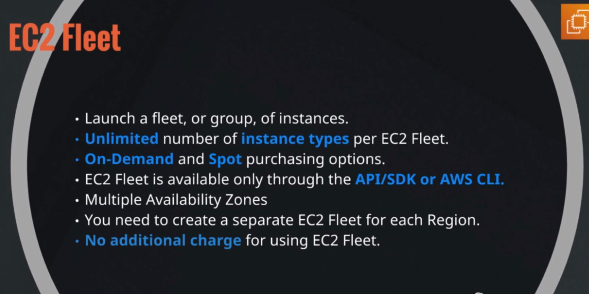

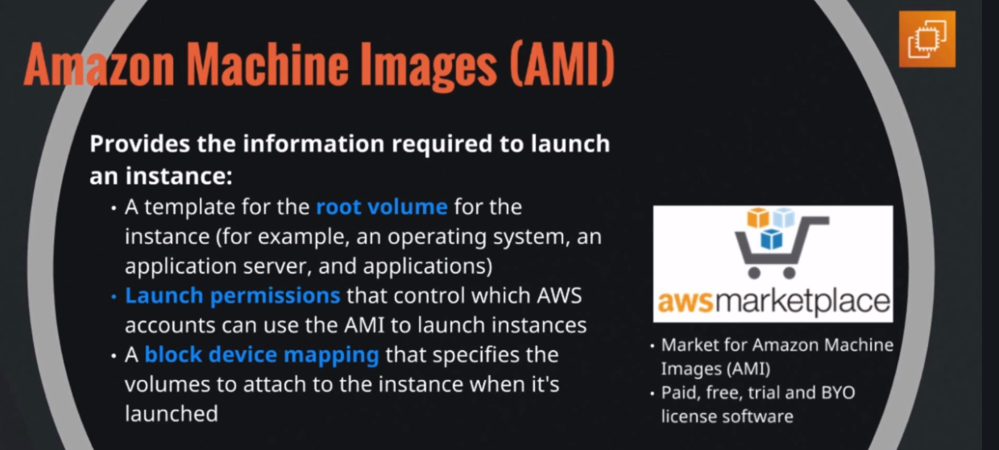


## EC2 Storage Options
- **Elastic Block Store (EBS)**
	- Most common.
	- Replicated **wihtin AZ**
	- EBS volumes attached at instance launch are **deleted when instance terminated.\***
	- EBS volumes attached to a **running** instance are **not deleted** when instance is terminated but are detached with data intact*.

\* Unless delete on terminate flat modified.

- **Instance Store**
	- Phisically attached to the host server
	- Data **NOT LOST** when OS is **rebooted**.
	- Data **LOST** when:

		- Underlying **drive fails**
		- Instance is **terminated**
	- Do not rely on for valuable, long-term data.
	- You **cannot detach** and attach to another instance.

### Storage settings

- **General Purpose SSD (gp2)**
	- default choice

- **Provisioned IOPS SSD (io1)**
	- Consistent and low-latency performance
	- I/O intensive applications such as large relational or NoSQL databases

- **Cold HDD (sc1)**
	- **Lowest cost per gigabyte**

- **Throughput Optimized HDD**
	- Low cost per gigabyte
	- Frequently accessed workloads

- **EBS Snapshots**
	- Point in time backup of EBS volume to Amazon S3.
	- Incremental backup.
	- Can be copied to other regions or accounts.

- **EBS Encryption**
	- AWS Key Management Service (KMS) master keys or Customer Master Key (CMK).
	- Data stored at rest encrypted (including snapshots created) as well as data in transit between EBS and EC2.

	