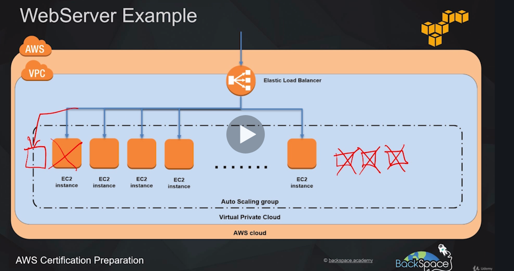
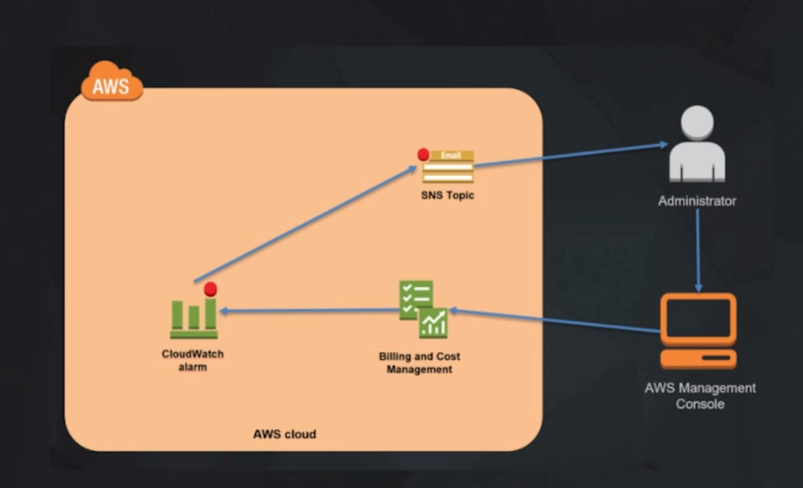

### AWS STORAGE SERVICES

### Simple Storage Services (S3)

#### Glacier

- Versão mais barata de armazenamento.
- Utilizado para manter dados por muito tempo.
- Não é acessivel tão facilmente como S3, deve ser utilizado para arquivamento de arquivos.
- É possível criar rotinas de envio de dados do S3 para Glacier.

#### Elastic Block Store (EBS)
- Alta disponibilidade, baixa latência armazenamento.
- Especificamente utilizado para anexar em conjunto com serviços em EC2.
- Similar ao anexar um HD a um computador.

#### Elastic File System (EFS)
- Network attached storage service, especificamente para serviços EC2.
- Por ser um serviço de armazenamento em rede, permite multiplos serviços acessar em um único datasource
- Similar com um NAS, onde vários serviços/dispositivos podem acessar um storage na rede de casa.

#### Storage Gateway
- Permite armazenamento híbrido entre ambientes locais e cloud da AWS.
- Tem baixa latência armazenando em cache dados usados com frequência

#### Snowball
	- Portátil, petabyte scale data storage, pode ser utilizado para migrar dados e grande volume de dados de on-premise ambiente até a aws cloud.
	- Simplesmente é preciso fazer download dos dados para o "snowball device", então enviar para AWS, que irá então fazer upload de dados para AWS storage service para você.

### Cloud Computing Models

### Infrastructure as a Service (IaaS)
- Contém a estrutura básica para Cloud IT
- VCP, EC2, EBS

### Platform as a Service (PaaS)
- AWS gerencia camada por baixo da infra (normalmente hardware e sistema operacional)
- RDS, EMR, ElasticSearch

### Software as a Service (SaaS)
- Produto completo que roda e é gerenciado pelo provedor de serviço. Normalmente se refere a aplicações de usuário final.
- Normalmente roda em navegador, email, Office363, Sallesforce.com

### Serverless Computing
- Permite criar e rodar aplicações sem pensar em servidores.
- Também referenciado como **Function-as-a-Service (FaaS)

Exemplos:
- Amazon Simple Storage Service (S3)
- AWS Lambda
- Amazon DynamoDB
- Amazon SNS

## AWS Database Services

### Relational Database (RDS)
- Serviço auto gerenciado
- MySQL, MariaDB, Amazon (versãoa própria de mySQL) Amazon Aurora, Standard Postgre, Amazon Aurora PostgreSQL, Microsoft SQL Server e Oracle.

### No SQL
- DynamoDB
- Redshift (utilizado para bigdata)
- ElasticCache: in-memory data store/cache.

### Diversos
- Database Migration Services (DMS): orquestra migração de databases através da AWS. Permite migrar dados de um tipo de banco para outro. Ex: (oracle => aurora)
- Amazon Neptune: Banco de dados em gráfo:  Alta performance, graph database, otimizado para salvar bilhões de relacionamentos e buscando informações do gráfo com latência de milissegundos.

#### Intro to Databases Services
- Criação de uma instância mysql na aws

#### Intro to Compute and Networking Services
- Elastic Compute Cloud (EC2):

	Provê serviços virtuais na cloud aws. É possível subir uma ou milhares de instâncias simultaneamente e só ser cobrado pela utilização.

- EC2 Autoscaling:

	Permite dinamicamente aumentar e diminuir capacidade de ec2 baseado em condições pré-definidas.

- Amazon Lightsail

	Maneira mais simples de lançar serviços virtuais rodando aplicações na aws.
	AWS vai prover tudo necessário, manutenção de DNS, STORAGE.

- Elastic Container Service (ECS)

	Alta escalabilidade e alta performance, serviço de gerenciamento de containeres para docker.
	Containers vão rodar em cluster gerenciado de instancias ec2.

- AWS Lambda

	Serviço que permite rodar código na cloud da AWS, removendo a preocupação em gerenciar serviços.
	Só subir código e aws vai se encarregar de rodar.

#### Exemplo 1 webserver utilizando autoscaling e LoadBalancer

### Intro to Networking & Content Delivery
- CloudFront:

	Clobal Content Delivery (CDN)
	Entrega com segurança conteúdo requisitado com frequência sobre mais de 100 pontos do globo e fazendo isso alcaça baixa latência e alta velocidade de transferência para usuários finais. Também provê proteção contra ataques **DDoS**

- Virtual Private Cloud (VPC)

	Permite isolamento lógico na cloud AWS. Dessa forma é possível subir serviços na rede virtual. Este é um espaço privado próprio na AWS. Ninguém de fora tem acesso (a não ser que seja permitido).

- Direct Connect

	Rede dedicada de alta velocidade com AWS. Empresas podem utilizar para estabelecer conexão privada com a cloud da aws em situações onde a conexão normal não seja adequada.

- Elastic Load Balancing (ELB)

	Distribui requisições de entrada automaticamente entre múltiplas instấncias ec2 e também em múltiplas zonas disponíveis. Então se uma zona disponível cair o tráfego será redirecionado para outra zona e a aplicação continua entregando respostas a requisições. Tabmém permite alcançar alta disponibilidade e tolerência a falhas com a distribuição do tráfego sobre as instâncias e ignora instâncias com problema.

- Amazon 53

	Nome de domínio (DNS) com alta disponibilidade e escalável. Pode direcionar tráfego para nome de domínio e direcionar esse tráfego para backend web-server.

- API Gateway

	Serviço gerenciado que facilita para desenvolvedores criar e disponibilizar APIS seguras em qualquer escala. Pode lidar com todas tarefas envolvendo aceitar e processar milhares ou milhões de chamadas concorrentes a API. É serverless, não é preciso se preocupar com infra.

#### Exemplo de network services

### AWS Management Tools
- CloudFormation:

	- Provisionar
	- Monitoramento e Logs
	- Administração de operações
	- Administração de configurações
	Permite que através de arquivo texto seja definida a infra.

- AWS Service Cataglog

	Permite que empresas cataloguem recursos que podem ser deployados na cloud aws. Isso permite que empresas
	consigam regras governamentais e conformidades para recursos de TI com uma definição clara do que pode ser deployado na aws.

- CloudWatch

	É um serviço de monitoramento para recursos da aws e aplicações que so deployadas na aws cloud. Pode ser utilizado para acionamentos de operações de escala e para prover clareza dos recursos deployados.

- AWS Systems Manager

	Provê uma interface de usuário unificada que permite visualizar dados operacionais de multiplos serviços AWS e automatizar tarefas através de recursos AWS. Isso reduz o tempo de detectar e resolver problemas operacionais.

- AWS CloudTrail

	Monitora e registra atividades de contas AWS incluindo ações tomadas através do AWS management Console, AWS software development kits, command-line tools e outros serviços. Então isso simplifica muito análises de  atividades de segurnça de usuários da conta.

- AWS Config

	Permite que acesse, audite e avalie configurações de recursos AWS. Isso simplifica auditoria, análise de segurança, gerenciamento de mudanças e controla e também resolução de problemas operacionais.

- OpsWorks

	Provê gerenciamento de instâncias de CHEF and PUPPET. Chef e Puppet podem ser usados para configurar e automatizar deployment de recursos.

- Trusted Advisor

	Experiente sistema online que analisa sua conta AWS e recursos de dentro e avisa você como conseguir alta segurança e melhor performance dos recursos.

#### Exemplo de notificação

### Application Integration
- Step Functions:

	Torna fácil coordenar componentes de aplicações distribuidas e microserviços utilizando um workflow visual. É criado uma série de steps visuais onde é possível definir o fluxo de trabalho e o que executa antes de o que ou se funções devem executar em paralelo.

- Simple WorkFlow Service (SWF)

	Trabalha de forma similar à Step Functions em coordenar múltiplios componentes sobre um processo. É mais recomendado utilizar Step Functions ao invés de SWF.

- Simple Notification Service (SNS)

	Serviço de comunicação (PUB-SUB) gerenciado pela aws. É possível criar um tópico e utilizar subscribers para esse tópico e quando for publicado mensagem naquele tópico os inscritos vão receber a notificação. Pode ser utilizado p/ push notifications em dispositivos mobile.

- Simple Queue Service (SQS)

	Serviço gerenciado para filas de mensagens. Torna fácil desacoplar aplicações.

#### Exemplo de desacoplamento de aplicação com fila e auto-scalling

### Customer Engagement
- Amazon Connect:

	Permite através de interface gráfica (arrastar e soltar) criar um fluxo de processo que define interações de cliente sem ter nada de codificação.

- Amazon Pinpoint:

	Envia e-mail, sms e push para alvos de marketing. Campanhas e mensagens diretas para clientes individualmente por ex. uma confirmação de compra.

- Simple Email Service (SES):

	Envio de e-mail em massa. Para uma conta estar apta no envio em massa é necessário solicitar á amazon liberação do sandbox. Deve ser feito um pedido direto na conta. https://docs.aws.amazon.com/ses/latest/DeveloperGuide/request-production-access.html

### Analytics
- Amazon Elastic MapReduce (EMR):

	AWS Hadoop framework como um serviço. É possível rodar outros frameworks no Amazon EMR que integra com Hadoop como **Apache Spark, HBase Presto e Flink**. Dados podem ser analisados por EMR em um número de fonte de dados que inclui S3 e DynamoDB.

- Amazon Athena:

	Permite analisar dados salvos direto no s3 usando consultas SQL.

- Amazon ElasticSearch Service:

	Serviço completamente gerenciado para elasic.com elasticsearch framework. Permite alta velocidade buscado e analisando dados salvos na aws.

- Kinesis:

	Permite coletar e processar dados de streaming em realtime.

- QuickSight:

	Business intelligence (BI) gerador de relatório, similar ao tableau. Serviço completamente gerenciado.

### Machine Learning
- DeepLens:

	Câmera Video profundo para estudos com kit de desenvolvimento que permite a criação de aplicações visuais avançadas.

- SageMaker:

	Permite construir e treinar modelos próprios de aprendizado de máquina e disponibilizar na cloud AWS para então utilizar no backend de aplicações.

- Rekognition:

	Prove aprendizado profundo baseado em análise de video e imagens.

- Amaxon Lex:

	Permite a construção de bots de chat conversacional, estes podem ser utilizados em muitas aplicações como primeira linha de contato para clientes.

- Amazon Polly:

	Prove sons naturais de texto para fala..

- Comprehend:

	Pode usar deep learning para analisar texto para insights e relacionamentos. Isto pode ser usado para análise de clientes ou busca avançada de documentos.

- Tranlate:

	Pode usar estudos de máquina para precisamente traduzir texto para um número diferente de linguas.

- Transcribe:

	Sistema de reconhecimento automático de falas que pode analisar arquivos de áudio que são salvos no s3 e retornar o texto transcrito.

### Security, Identity & Compliance
- AWS Artifact:

	Portal online que prove documentos sobre acesso à segurança e conformidade AWS documentação e essa documentação está prontamente disponível quando necessrio para fins de auditoria e conformidade.

- AWS Certificate Manager:

	Requisita certificados ssl para comunicação `HTTPS` com site e integra em serviços AWS como ****ROUTE 53** e **CloudFront** e os certificados providos através do gerenciador de certificados são completamente **sem custo**.

- AWS Cloud directory:

	Serviço de diretorório em núvem que pode ter dados hierárquicos em múltiplas dimensões diferente de diretório convencial baseado em **LDAP** que podem ter somente uma hierarquia.

- AWS Directory Service:

	Diretório ativo microsoft é um serviço completamente gerenciado.

- CloudHSM:

	Módulo dedicado de segurança na cloud aws permite alcançar conformidade corporativa e regulamenttos enquanto ao mesmo tempo reduzindo significativamente custos sobre utilizar um HSM em uma infra própria.

- Cognito:

	Prove habilidades de login e cadastro para aplicações web e mobile também permite integrar o processo de cadastro com provedores externos como Google e Facebook e também SAML 2.

- Identity and Access Management (IAM):

	Permite gerenciar acesso de usuário para recursos e serviços aws de uma conta, usuários e grupos de usuários tem permissões individuais que permitem ou negam acesso a recursos

- AWS Organizations:

	Prove gerenciamento de politicas de privacidade para multiplas contas aws. É bom para grandes organizações que tem muitas contas e eles querem gerenciar contas de usuários centralizadamente na amazon.

- Amazon Inspector:

	Serviço automatizado de avaliação de segurança, pode ajudar a encontrar falhas ou áreas para melhorar em uma conta aws.

- Key Management Service (KMS):

	Torna fácil criar e controlar chaves criptográficas para dados criptografados também usa módulos de segurança de hardware para  suas chaves Tem boa integração com serviços como: S3, Redshift e EBS.

- AWS Shield:

	Prove proteção contra negação de serviço distribuido (DDoS). Versão padrão de proteção é implementado automaticamente em todas contas aws.

- Web Application Firewall (WAF):

	Firewall aplicação web que fica na frente de website para prover proteção adicional contra ataques comuns de **SQL INJECTION** e **cross-site scripting**. Tem diferentes conjunto de regras que podem ser usados em diferentes aplicações.

### AWS Developer Tools
- Cloud 9:

	Ambiente de desenvolvimento integrado (IDE) rodando na cloud aws que permite fazer deploy de servidores diretamente para aws de IDE.

- CodeStar:

	Torna fácil desenvolver e disponibilizar aplicações na aws pode gerenciar todo pipeline de CI/CD. Tem um gerenciador de projetos incluindo issue tracking provido por Atlassian JIRA Software.

- X-Ray:

	Torna fácil analisar e debugar aplicações isto permite um melhor entendimento de performance da aplicação e serviços ligados.

- CodeCommit:

	É um repositório git parecido com github e está rodando na cloud aws.

- CodePipeline:

	É integração e distribuição contínua (CI/CD). Pode criar o build, testar e deployar cada vez que o código é modificado.

- CodeBuild:

	Compila código fonte, roda testes e produz pacotes de software que estão prontos para ser deployados na aws.

- CodeDeploy:

	Serviço que automatiza disponibilização de software para uma variedade de serviços computacionais incluindo: **ec2, AWS lambda** e até instấncias que estão rodando localmente.

### AWS Media Services
- Elemental MediaConvert:

	É um serviço de transcodificação video baseado em texto para converter formatos de video sob demanda.

- Elemental MediaPackage:

	Prepara conteúdos de video para distribuição através da internet também  protege contra privacidade através de gerenciamento de direitos autorais.

- Elemental MediaTailor:

	Insere individualmente propagandas personalizadas em conteúdos de video

- Elemental MediaLive:

	Serviço de video ao vivo para transmissão de vídeo na internet.

- Elemental MediaStore:

	Serviço de armazenamento na cloud aws otimizado para multimídia.

- Kinesis Video Streams:

	Transmissão de videos de dispositivos conectados através da cloud aws para análise e estudos de máquina e outras aplicações de processamento.

### Mobile Services
- AWS Mobile Hub:

	Permite facilmente configurar serviços aws para dispositivos mobile em um lugar este gera cloud configuração que salva informação sobre os serviços configurados.

- AWS Device Farm:

	É um serviço de testes para (iOS, Android e web-apps) permite testar aplicativo contra uma grande coleção de dispositivos físicosna cloud aws.

- AWS AppSync

	GraphQL backend para dispositivos móveis e aplicações web.

### AWS Migration Services
- AWS Application Discovery Service:

	O serviço de descoberta de aplicativos reúne informações sobre a empresa data centers locais para ajudar a migração para os dados aws, dados são retidos em um formato criptografado em um serviço de discoberta.

- AWS Database Migration Service:

	Orquestra a migração de bancos de dados através da cloud aws também permite a migração de de um tipo de banco para outro totalmente diferente: Ex migrar Oracle  para AWS Aurora.

- AWS Server Migration Service:

	Pode automatizar a migração de milhares de cargas de trabalho locais para cloud aws reduzindo custos e minimiza tempo e inatividade para migrações.

- AWS Snowball:

	Dispositivo portátil de armazenamento extensível petabyte pode ser usado para migração de ambientes locais para cloud aws.

### Business Productivity & App Streaming
- Amazon WorkDocs:

	Serviço completamente gerenciado seguro de colaboração e gerenciamento de arquivos na cloud aws. O cliente web permite visualizar e comentar em mais de 35 tipos de arquivo diferente inluindo microsoft office e pdf.

- Amazon WorkMail:

	Serviço seguro gerenciado email e calendário empresarial.

- Amazon Chime:

	Serviço de conferência Online, bom para empresas, reuniões online, video conferências, chamadas e compartilhamento de conteúdo de dentro e fora da empresa.

- Amazon WorkSpaces:

	Serviço completamente gerenciado seguro "desktop as service" pode de maneira fácil ter um desktop windows ou linux.

- Amazon AppStream 2.0:

	Serviço de transmissão completamente gerenciado permite a transmissão de desktops aws para navegador compatível com html5, é bom para usurios que querem acessar suas aplicações de qualquer lugar.

### Internet of Things (IoT)
- AWS IOT:

	Plataforma gerenciada na nuvem que permite embutir dispositivos como microcontroladores e Raspberry Pi, para com segurnaça interagir com a nuvem.

-  Amazon FreeRTOS:

	Sistema operacional para microcontroladores como o microhip pic32 que permite dispositivos de baixo custo e baixa energia conectar com aws IoT.

-  AWS Greengras:

	Software que permite rodar localmente funções aws lambda e sincronização e armazenamento em cache de dados de mensagens de aplicações de machine learning em dispositivos conectados IoT.

### Game Development
- Amazon Gamelift:

	Permite gerenciar, extender e disponibilizar servidores dedicados na cloud aws.

- Amazon Lumberyard:

	Ambiente de desenvolvimento de jogos e multiplataforma triple-a engine na cloud aws.