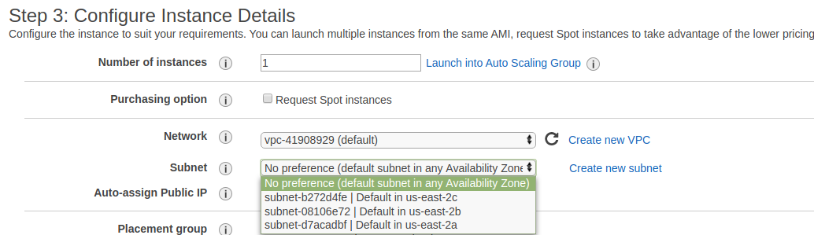
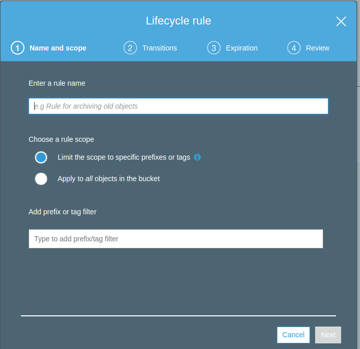
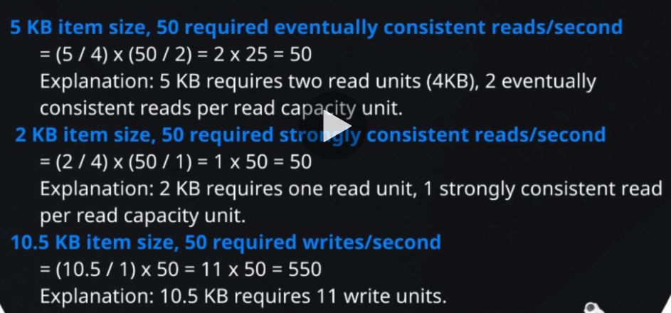
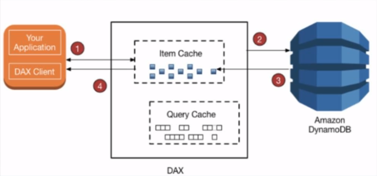
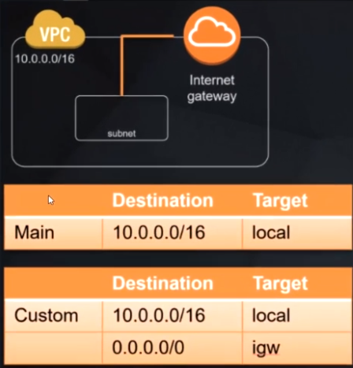

### AWS STORAGE SERVICES

### Simple Storage Services (S3)

#### Glacier

- Versão mais barata de armazenamento.
- Utilizado para manter dados por muito tempo.
- Não é acessivel tão facilmente como S3, deve ser utilizado para arquivamento de arquivos.
- É possível criar rotinas de envio de dados do S3 para Glacier.

#### Elastic Block Store (EBS)
- Alta disponibilidade, baixa latência armazenamento.
- Especificamente utilizado para anexar em conjunto com serviços em EC2.
- Similar ao anexar um HD a um computador.

#### Elastic File System (EFS)
- Network attached storage service, especificamente para serviços EC2.
- Por ser um serviço de armazenamento em rede, permite multiplos serviços acessar em um único datasource
- Similar com um NAS, onde vários serviços/dispositivos podem acessar um storage na rede de casa.

#### Storage Gateway
- Permite armazenamento híbrido entre ambientes locais e cloud da AWS.
- Tem baixa latência armazenando em cache dados usados com frequência

#### Snowball
	- Portátil, petabyte scale data storage, pode ser utilizado para migrar dados e grande volume de dados de on-premise ambiente até a aws cloud.
	- Simplesmente é preciso fazer download dos dados para o "snowball device", então enviar para AWS, que irá então fazer upload de dados para AWS storage service para você.


### Cloud Computing Models

### Infrastructure as a Service (IaaS)
- Contém a estrutura básica para Cloud IT
- VCP, EC2, EBS

### Platform as a Service (PaaS)
- AWS gerencia camada por baixo da infra (normalmente hardware e sistema operacional)
- RDS, EMR, ElasticSearch

### Software as a Service (SaaS)
- Produto completo que roda e é gerenciado pelo provedor de serviço. Normalmente se refere a aplicações de usuário final.
- Normalmente roda em navegador, email, Office363, Sallesforce.com


### Serverless Computing
- Permite criar e rodar aplicações sem pensar em servidores.
- Também referenciado como **Function-as-a-Service (FaaS)

Exemplos:
- Amazon Simple Storage Service (S3)
- AWS Lambda
- Amazon DynamoDB
- Amazon SNS

## AWS Database Services

### Relational Database (RDS)
- Serviço auto gerenciado
- MySQL, MariaDB, Amazon (versãoa própria de mySQL) Amazon Aurora, Standard Postgre, Amazon Aurora PostgreSQL, Microsoft SQL Server e Oracle.

### No SQL
- DynamoDB
- Redshift (utilizado para bigdata)
- ElasticCache: in-memory data store/cache.

### Diversos
- Database Migration Services (DMS): orquestra migração de databases através da AWS. Permite migrar dados de um tipo de banco para outro. Ex: (oracle => aurora)
- Amazon Neptune: Banco de dados em gráfo:  Alta performance, graph database, otimizado para salvar bilhões de relacionamentos e buscando informações do gráfo com latência de milissegundos.


#### Intro to Databases Services
- Criação de uma instância mysql na aws

#### Intro to Compute and Networking Services
- Elastic Compute Cloud (EC2):

	Provê serviços virtuais na cloud aws. É possível subir uma ou milhares de instâncias simultaneamente e só ser cobrado pela utilização.

- EC2 Autoscaling:

	Permite dinamicamente aumentar e diminuir capacidade de ec2 baseado em condições pré-definidas.

- Amazon Lightsail

	Maneira mais simples de lançar serviços virtuais rodando aplicações na aws.
	AWS vai prover tudo necessário, manutenção de DNS, STORAGE.

- Elastic Container Service (ECS)

	Alta escalabilidade e alta performance, serviço de gerenciamento de containeres para docker.
	Containers vão rodar em cluster gerenciado de instancias ec2.

- AWS Lambda

	Serviço que permite rodar código na cloud da AWS, removendo a preocupação em gerenciar serviços.
	Só subir código e aws vai se encarregar de rodar.

#### Exemplo 1 webserver utilizando autoscaling e LoadBalancer


### Intro to Networking & Content Delivery
- CloudFront:

	Clobal Content Delivery (CDN)
	Entrega com segurança conteúdo requisitado com frequência sobre mais de 100 pontos do globo e fazendo isso alcaça baixa latência e alta velocidade de transferência para usuários finais. Também provê proteção contra ataques **DDoS**

- Virtual Private Cloud (VPC)

	Permite isolamento lógico na cloud AWS. Dessa forma é possível subir serviços na rede virtual. Este é um espaço privado próprio na AWS. Ninguém de fora tem acesso (a não ser que seja permitido).

- Direct Connect

	Rede dedicada de alta velocidade com AWS. Empresas podem utilizar para estabelecer conexão privada com a cloud da aws em situações onde a conexão normal não seja adequada.

- Elastic Load Balancing (ELB)

	Distribui requisições de entrada automaticamente entre múltiplas instấncias ec2 e também em múltiplas zonas disponíveis. Então se uma zona disponível cair o tráfego será redirecionado para outra zona e a aplicação continua entregando respostas a requisições. Tabmém permite alcançar alta disponibilidade e tolerência a falhas com a distribuição do tráfego sobre as instâncias e ignora instâncias com problema.

- Amazon 53

	Nome de domínio (DNS) com alta disponibilidade e escalável. Pode direcionar tráfego para nome de domínio e direcionar esse tráfego para backend web-server.

- API Gateway

	Serviço gerenciado que facilita para desenvolvedores criar e disponibilizar APIS seguras em qualquer escala. Pode lidar com todas tarefas envolvendo aceitar e processar milhares ou milhões de chamadas concorrentes a API. É serverless, não é preciso se preocupar com infra.

#### Exemplo de network services


### AWS Management Tools
- CloudFormation:

	- Provisionar
	- Monitoramento e Logs
	- Administração de operações
	- Administração de configurações
	Permite que através de arquivo texto seja definida a infra.

- AWS Service Cataglog

	Permite que empresas cataloguem recursos que podem ser deployados na cloud aws. Isso permite que empresas
	consigam regras governamentais e conformidades para recursos de TI com uma definição clara do que pode ser deployado na aws.

- CloudWatch

	É um serviço de monitoramento para recursos da aws e aplicações que so deployadas na aws cloud. Pode ser utilizado para acionamentos de operações de escala e para prover clareza dos recursos deployados.

- AWS Systems Manager

	Provê uma interface de usuário unificada que permite visualizar dados operacionais de multiplos serviços AWS e automatizar tarefas através de recursos AWS. Isso reduz o tempo de detectar e resolver problemas operacionais.

- AWS CloudTrail

	Monitora e registra atividades de contas AWS incluindo ações tomadas através do AWS management Console, AWS software development kits, command-line tools e outros serviços. Então isso simplifica muito análises de  atividades de segurnça de usuários da conta.

- AWS Config

	Permite que acesse, audite e avalie configurações de recursos AWS. Isso simplifica auditoria, análise de segurança, gerenciamento de mudanças e controla e também resolução de problemas operacionais.

- OpsWorks

	Provê gerenciamento de instâncias de CHEF and PUPPET. Chef e Puppet podem ser usados para configurar e automatizar deployment de recursos.

- Trusted Advisor

	Experiente sistema online que analisa sua conta AWS e recursos de dentro e avisa você como conseguir alta segurança e melhor performance dos recursos.


#### Exemplo de notificação


### Application Integration
- Step Functions:

	Torna fácil coordenar componentes de aplicações distribuidas e microserviços utilizando um workflow visual. É criado uma série de steps visuais onde é possível definir o fluxo de trabalho e o que executa antes de o que ou se funções devem executar em paralelo.

- Simple WorkFlow Service (SWF)

	Trabalha de forma similar à Step Functions em coordenar múltiplios componentes sobre um processo. É mais recomendado utilizar Step Functions ao invés de SWF.

- Simple Notification Service (SNS)

	Serviço de comunicação (PUB-SUB) gerenciado pela aws. É possível criar um tópico e utilizar subscribers para esse tópico e quando for publicado mensagem naquele tópico os inscritos vão receber a notificação. Pode ser utilizado p/ push notifications em dispositivos mobile.

- Simple Queue Service (SQS)

	Serviço gerenciado para filas de mensagens. Torna fácil desacoplar aplicações.

#### Exemplo de desacoplamento de aplicação com fila e auto-scalling


### Customer Engagement
- Amazon Connect:

	Permite através de interface gráfica (arrastar e soltar) criar um fluxo de processo que define interações de cliente sem ter nada de codificação.

- Amazon Pinpoint:

	Envia e-mail, sms e push para alvos de marketing. Campanhas e mensagens diretas para clientes individualmente por ex. uma confirmação de compra.

- Simple Email Service (SES):

	Envio de e-mail em massa. Para uma conta estar apta no envio em massa é necessário solicitar á amazon liberação do sandbox. Deve ser feito um pedido direto na conta. https://docs.aws.amazon.com/ses/latest/DeveloperGuide/request-production-access.html


### Analytics
- Amazon Elastic MapReduce (EMR):

	AWS Hadoop framework como um serviço. É possível rodar outros frameworks no Amazon EMR que integra com Hadoop como **Apache Spark, HBase Presto e Flink**. Dados podem ser analisados por EMR em um número de fonte de dados que inclui S3 e DynamoDB.

- Amazon Athena:

	Permite analisar dados salvos direto no s3 usando consultas SQL.

- Amazon ElasticSearch Service:

	Serviço completamente gerenciado para elasic.com elasticsearch framework. Permite alta velocidade buscado e analisando dados salvos na aws.

- Kinesis:

	Permite coletar e processar dados de streaming em realtime.

- QuickSight:

	Business intelligence (BI) gerador de relatório, similar ao tableau. Serviço completamente gerenciado.


### Machine Learning
- DeepLens:

	Câmera Video profundo para estudos com kit de desenvolvimento que permite a criação de aplicações visuais avançadas.

- SageMaker:

	Permite construir e treinar modelos próprios de aprendizado de máquina e disponibilizar na cloud AWS para então utilizar no backend de aplicações.

- Rekognition:

	Prove aprendizado profundo baseado em análise de video e imagens.

- Amaxon Lex:

	Permite a construção de bots de chat conversacional, estes podem ser utilizados em muitas aplicações como primeira linha de contato para clientes.

- Amazon Polly:

	Prove sons naturais de texto para fala..

- Comprehend:

	Pode usar deep learning para analisar texto para insights e relacionamentos. Isto pode ser usado para análise de clientes ou busca avançada de documentos.

- Tranlate:

	Pode usar estudos de máquina para precisamente traduzir texto para um número diferente de linguas.

- Transcribe:

	Sistema de reconhecimento automático de falas que pode analisar arquivos de áudio que são salvos no s3 e retornar o texto transcrito.


### Security, Identity & Compliance
- AWS Artifact:

	Portal online que prove documentos sobre acesso à segurança e conformidade AWS documentação e essa documentação está prontamente disponível quando necessrio para fins de auditoria e conformidade.

- AWS Certificate Manager:

	Requisita certificados ssl para comunicação `HTTPS` com site e integra em serviços AWS como ****ROUTE 53** e **CloudFront** e os certificados providos através do gerenciador de certificados são completamente **sem custo**.

- AWS Cloud directory:

	Serviço de diretorório em núvem que pode ter dados hierárquicos em múltiplas dimensões diferente de diretório convencial baseado em **LDAP** que podem ter somente uma hierarquia.

- AWS Directory Service:

	Diretório ativo microsoft é um serviço completamente gerenciado.

- CloudHSM:

	Módulo dedicado de segurança na cloud aws permite alcançar conformidade corporativa e regulamenttos enquanto ao mesmo tempo reduzindo significativamente custos sobre utilizar um HSM em uma infra própria.

- Cognito:

	Prove habilidades de login e cadastro para aplicações web e mobile também permite integrar o processo de cadastro com provedores externos como Google e Facebook e também SAML 2.

- Identity and Access Management (IAM):

	Permite gerenciar acesso de usuário para recursos e serviços aws de uma conta, usuários e grupos de usuários tem permissões individuais que permitem ou negam acesso a recursos

- AWS Organizations:

	Prove gerenciamento de politicas de privacidade para multiplas contas aws. É bom para grandes organizações que tem muitas contas e eles querem gerenciar contas de usuários centralizadamente na amazon.

- Amazon Inspector:

	Serviço automatizado de avaliação de segurança, pode ajudar a encontrar falhas ou áreas para melhorar em uma conta aws.

	- Assistente de segurança automático
	- Reduz custo e aumenta efetividade de assistência e conformidade
	- Preço inicia em $ 0.30 por agente-assistente por mês utilizando desconto de volume é possível atingir um valor mímino de $ 0.05 por agente-assistente por mês.


- Key Management Service (KMS):

	Torna fácil criar e controlar chaves criptográficas para dados criptografados também usa módulos de segurança de hardware para  suas chaves Tem boa integração com serviços como: S3, Redshift e EBS.

- AWS Shield:

	Prove proteção contra negação de serviço distribuido (DDoS). Versão padrão de proteção é implementado automaticamente em todas contas aws.

- Web Application Firewall (WAF):

	Firewall aplicação web que fica na frente de website para prover proteção adicional contra ataques comuns de **SQL INJECTION** e **cross-site scripting**. Tem diferentes conjunto de regras que podem ser usados em diferentes aplicações.


### AWS Developer Tools
- Cloud 9:

	Ambiente de desenvolvimento integrado (IDE) rodando na cloud aws que permite fazer deploy de servidores diretamente para aws de IDE.

- CodeStar:

	Torna fácil desenvolver e disponibilizar aplicações na aws pode gerenciar todo pipeline de CI/CD. Tem um gerenciador de projetos incluindo issue tracking provido por Atlassian JIRA Software.

- X-Ray:

	Torna fácil analisar e debugar aplicações isto permite um melhor entendimento de performance da aplicação e serviços ligados.

- CodeCommit:

	É um repositório git parecido com github e está rodando na cloud aws.

- CodePipeline:

	É integração e distribuição contínua (CI/CD). Pode criar o build, testar e deployar cada vez que o código é modificado.

- CodeBuild:

	Compila código fonte, roda testes e produz pacotes de software que estão prontos para ser deployados na aws.

- CodeDeploy:

	Serviço que automatiza disponibilização de software para uma variedade de serviços computacionais incluindo: **ec2, AWS lambda** e até instấncias que estão rodando localmente.


### AWS Media Services
- Elemental MediaConvert:

	É um serviço de transcodificação video baseado em texto para converter formatos de video sob demanda.

- Elemental MediaPackage:

	Prepara conteúdos de video para distribuição através da internet também  protege contra privacidade através de gerenciamento de direitos autorais.

- Elemental MediaTailor:

	Insere individualmente propagandas personalizadas em conteúdos de video

- Elemental MediaLive:

	Serviço de video ao vivo para transmissão de vídeo na internet.

- Elemental MediaStore:

	Serviço de armazenamento na cloud aws otimizado para multimídia.

- Kinesis Video Streams:

	Transmissão de videos de dispositivos conectados através da cloud aws para análise e estudos de máquina e outras aplicações de processamento.


### Mobile Services
- AWS Mobile Hub:

	Permite facilmente configurar serviços aws para dispositivos mobile em um lugar este gera cloud configuração que salva informação sobre os serviços configurados.

- AWS Device Farm:

	É um serviço de testes para (iOS, Android e web-apps) permite testar aplicativo contra uma grande coleção de dispositivos físicosna cloud aws.

- AWS AppSync

	GraphQL backend para dispositivos móveis e aplicações web.


### AWS Migration Services
- AWS Application Discovery Service:

	O serviço de descoberta de aplicativos reúne informações sobre a empresa data centers locais para ajudar a migração para os dados aws, dados são retidos em um formato criptografado em um serviço de discoberta.

- AWS Database Migration Service:

	Orquestra a migração de bancos de dados através da cloud aws também permite a migração de de um tipo de banco para outro totalmente diferente: Ex migrar Oracle  para AWS Aurora.

- AWS Server Migration Service:

	Pode automatizar a migração de milhares de cargas de trabalho locais para cloud aws reduzindo custos e minimiza tempo e inatividade para migrações.

- AWS Snowball:

	Dispositivo portátil de armazenamento extensível petabyte pode ser usado para migração de ambientes locais para cloud aws.

### Business Productivity & App Streaming
- Amazon WorkDocs:

	Serviço completamente gerenciado seguro de colaboração e gerenciamento de arquivos na cloud aws. O cliente web permite visualizar e comentar em mais de 35 tipos de arquivo diferente inluindo microsoft office e pdf.

- Amazon WorkMail:

	Serviço seguro gerenciado email e calendário empresarial.

- Amazon Chime:

	Serviço de conferência Online, bom para empresas, reuniões online, video conferências, chamadas e compartilhamento de conteúdo de dentro e fora da empresa.

- Amazon WorkSpaces:

	Serviço completamente gerenciado seguro "desktop as service" pode de maneira fácil ter um desktop windows ou linux.

- Amazon AppStream 2.0:

	Serviço de transmissão completamente gerenciado permite a transmissão de desktops aws para navegador compatível com html5, é bom para usurios que querem acessar suas aplicações de qualquer lugar.


### Internet of Things (IoT)
- AWS IOT:

	Plataforma gerenciada na nuvem que permite embutir dispositivos como microcontroladores e Raspberry Pi, para com segurnaça interagir com a nuvem.

-  Amazon FreeRTOS:

	Sistema operacional para microcontroladores como o microhip pic32 que permite dispositivos de baixo custo e baixa energia conectar com aws IoT.

-  AWS Greengras:

	Software que permite rodar localmente funções aws lambda e sincronização e armazenamento em cache de dados de mensagens de aplicações de machine learning em dispositivos conectados IoT.


### Game Development
- Amazon Gamelift:

	Permite gerenciar, extender e disponibilizar servidores dedicados na cloud aws.

- Amazon Lumberyard:

	Ambiente de desenvolvimento de jogos e multiplataforma triple-a engine na cloud aws.


## AWS Command LIne Interface (cli)


## CLI Lab
- Criar ambiente Cloud9
- Criar bucket s3 usando linha de comando
- Upload e delete de objeto
- Remoção de bucket


### Elastic Beanstalk
Serviço de deploy que permite disponibilizar aplicações para arquiteturas complexas na aws sem ter que se preocupar sobre a camada por trás.

- Laucnhed in 2011
- Quichly deploy and manage applications on environments
- Automatically handles **capacity** provisioning, **load balancing, scaling**, and application **helth monitoring.**
- New versions can be uploaded through the **console** or **CLI** and, environment re-deployed.

	- Applications can be:

		- Docker Containers
		- NodeJS, Java, .NET, PHP, Ruby, Python & Go.
		- On servers such as Apache, Nginx, Passenger, and IIS.


### O que é uma arquitetura de alta disponibilidate e tolerante a falhas ?


#### Deployment options:

- All at once,
- Rolling (a batch at a time), Rolling with additional batch,
- Immutable (two environments temporarily),
- Blue - Green (two environments).


### Business Case for AWS

#### 6 Vantagens da computação em nuvem
- Troca de custo alto por custo variável
- Benefícios de grande economia de escala
- Parar de adivinhar capacidades
- Aumentar velocidade e agilidade
- Parar de gastar dinheiro rodando e mantendo servidores
- Ser global em minutos

### AWS Compliance Program

- Cobre uma grande variedade de certificações, leis e regulações e frameworks que aws está em conformidade ou pode ajudar para ter conformidade em.


### AWS Artifact

- Repositório central de informações relacionadas conformidades.
- Acesso sob demanda para segurança e relatórios de conformidade e seleção online de acordos ex:
	- Service Organization Control (SOC)
	- Payment Card Industry (PCI)
- Acessado através do AWS Management Console


### AWS Architecture and Compliance

- O centro de arquitetura AWS provê uma coleção de recursos técnicos para ajudar a construir mais eficaz e eficiente na cloud aws. https://aws.amazon.com/architecture

- AWS Well-Architected: https://aws.amazon.com/architecture/well-architected/
- Compliance: https://aws.amazon.com/compliance


### Entregando websites HTML5 a prova de balas com Amazon Web Services
- Comprar um nome de domínio (através de Route53)
- Upload site aws s3
- Ativar s3 hospedagem de site
- Encriptação HTTP/SSL
- Roteamento de tráfego com Route 53
- Criar uma distribuição CloudFront


### Steps para liberar um site para ser público no S3

- 1 Criar um bucket para o site (melhor nomenclatura do bucket próprio domínio) [Console](https://s3.console.aws.amazon.com/s3/home?region=us-east-1)

	- 1.1 Desmarcar opção para bloquear todo conteúdo.
		- 1.1.2 Copirar código (ARN) do bucket
	- 1.2 Entrar nas configurações do bucket **Permissions** e depois **Bucket Policy**
	- 1.3 Gerar políticas de privacidade. [link](https://awspolicygen.s3.amazonaws.com/policygen.html)

		- 1.3.1 Select type of policy => S3 Bucket Policy
		- 1.3.2 Principal => *
		- 1.3.3 AWS Service S3
		- 1.3.4 Actions => GetObject
		- 1.3.5 Colar o código (ARN) e adicionar **/\*** para permitir acesso a tudo após raiz
		- 1.3.6 Add Statement
		- 1.3.7 Add Generate Policy
		- 1.3.8 Copiar json de policy gerado e colar na tela aberta no step **1.2** e salvar.

		OBS: Deverá mostrar a msg: **This bucket has public access**
- 2 Fazer upload dos arquivos estáticos para o s3

	- 2.1 Na aba de permissões deixar acesso de leitura público
	- 2.2 Storage class => Standard

- 3 Permitir que bucket seja utilizado como website estático
	- 3.1 Properties => Static website hosting, **Use this bucket to host a website** e informar o nome do arquivo index.

### Criação de certificados SSL com Certificate Manager

- 1 Acessar [Console](https://console.aws.amazon.com/acm/home?region=us-east-1#/firstrun/)
- 2 Provision certificates => Get started

	- 2.1 Rquest a public certificate => Request a certificate

	Colocando **\*.DOMAIN..** todos os subdomínios vão ter o certificado também.

	

	- 2.2 Escolher opção DSN VALIDATION

	- 2.3 Adicionar CNAME no provedor de dns

	

### Criação de CloudFront Distribution
- Com ele conteúdo estático de site estará disponível em diversos pontos estratégicos espalhados pelo globo, fazendo com que requests ao conteúdo sejam disponibilizadas do local mais próximo aumentado a velocidade.
- Reduz custos, pois conteúdo solicitado vai ser menos requisitado do s3.
- Também provê alguns adicionais de segurança (DDoS).
- Acessar [Console](https://console.aws.amazon.com/cloudfront/home?region=us-east-1#)
- Criar uma distribuição

	

	- Origin Domain Name => mesmo do bucket
	- Origin Path => não precisa
	#### Default Cache Behavior Settings
	- Redirect HTTP to HTTPS

	#### Distribution Settings
	- Alternate Domain Names (CNAMES) => informar **domínio** e o **www** ex:

			coddare.com.br
			www.coddare.com.br

	- SSL Certificate => Custom SSL Certificate, selecionar o certificado criado

	

	- Default Root Object => index.html

	- Enable IPv6 => desativado (não necessário)
	- Comment => nome do domínio => coddare.com.br
	- Salvar e Aguardar .. demora cerca de 30 min.
	- Após liberação e replicação para todos os **edge locations**, é necessário garantir que
	ROUTE 53 está sendo redirecionado para o CloudFront distribution

### Redirecionamento com Route 53
- Acessar [Console](https://console.aws.amazon.com/route53/home?region=us-east-1)
- Create Record Set

	
- Deve ser criado outro Record set para o **www**

	- Type => CNAME Canonical name
	- Alias => False
	- Alinas Value (cloud front dns)

- Existe um site para verificar a propagação do dns acessar através do [Link](https://www.whatsmydns.net/)

### Invalidar dados no CloudFront
- Como CloudFront tem um ttl de 24 horas, caso novo conteúdo seja disponibilizado, não será atualizado até que esse tempo passe, caso seja necessário, deve ser invalidado CloudFront.
- Ir na distribuição => Inalidations


- É possível invalidar arquivos específicos ou todo conteúdo Ex:

		index.html
		images/*

### Redirecionamento de vários domínios para um só

	- coddare.com
	- coddare.net
	- coddare.tech

Fazer todos serem redirecionados para: `coddare.com.br`

No bucket criado na parte de wetbsite hosting **Adicionar Redirect requets**


### IAM, Organizations E CloudTrail

- AWS Security Shared Responsibility


#### What is IAM ?

- A **web service** that allows you to securely control individual and group access to your AWS resources.
- Create and manage user identities ("**IAM users**") and grant permissions.
- Features

	- **Shared access** to your AWS account
	- **Granular** permissions
	- Secure access to AWS resources for applications that run on **Amazon EC2**
	- **Identity federation** to grant permissions for users outside of AWS
	- Payment Card Industry (**PCI**) Data Security Standard (**DDS**) Compliance
	- Access log auditing using **CloudTrail**
	- **Eventually** Consistent
	- **Free** to use

#### Users

- Represent person or service acessing your account
- Consists of a **name** and **credentials**
- Users are identified by:

	- A "**friendly name**" eg: **"Bil"**
	- Amazon Resource Name (**ARN**)

			arm:aws:iam::acccount-ID-withoud-hyphens:user/Bill

	- **Unique Identifier** which is returned only when you use the API, SDKs, Tools for Windows PowerShell, or AWS CLI to create the user.

- Credentials can be associated to a user:

	- **Console password.** User will have aurl link to login to the console.
	- **Access keys** (access key ID and a secret key), max 2.

- **Never use root user** to access resources unless absolutely essentials. Create admin users with required permissions. Always enable multi-factor authentication of the root user.


#### User password Policies
- You can use a password policy to do these things:

	- Set a minimum password length
	- Require specific character types.
	- Allow all IAM users to change their own passwords.
	- Password expiration.
	- Prevent users from resusing previous passwords.
	- Force users to contact an account administrator when the password expired.


## Groups
- **Collection** of IAM users.
- Users **assume** the permissions of the group.
- Users can belong to **multiple groups**
- Groups can only contain users, **cannot be nested**.


## Roles
- Defined permissions that can be assumed by **users or resources**.
- Allow **EC2 instances** to access other AWS resources.
- Grant access to your resources to users in **another AWS account**
- Can be used to allow users to temporarily assume a role with least privilege access to critial resources.
**Identity federation** using:

	- AWS Cognito
	- OAUTH (Facebook, Google eeet)
	- Enterprise Single Sign On with LDAP or Active Directory

## AWS Organisations
- Allows multiple AWS accounts used by an organisation to be part of an **Organisational Unit** (OU)
- **Service Control Policies** (SCPs) allow the whitelisting or blacklisting of service within an Organisational Unit.
- A **blacklisted** service will not be available even if the IAM user or group policy allows it.
- Benefits:

	- **Centrally manage** policies across multiple AWS accounts
	- **Control access** to AWS services
	- **Automate** AWS account creation and management programmatically with APIs
	- **Consolidate billing** across multiple AWS accounts

	

## IAM Policies
 - By default, users cant't access anything in your account
 - Grant permissions through **policies** that define the effect, actions, resources, and optional conditions.

	```json
	{
		"Version": "2012-10-17",
		"Statement": {
			"Effect": "Allow",
			"Action": "dynamodb:*",
			"Resource": "arn:aws:dynamodb:us-west-2:123456789012:table/Books",
		}
	}
	```

#### Amazon Resource Names (ARN)
The access policy language requires you to specify the resource or resources using the following Amazon Resource Name (ARN) format:

		arn:aws:iam::account:resource (note region missing)

Examples:

An IAM user in the account: `arn:aws:iam::123456789012:user/Bob`

An IAM group: `arn:aws:iam::123456789012:group/Developers`

An IAM role: `arn:aws:iam::123456789012:role/S3Access`

An instance profile that can be associated with an EC2 instance: `arn:aws:iam::123456789012:instance-profile/Webserver`

A federated user identified an IAM as "Bob": `arn:aws:sts::123456789012:federated-user/Bob`


### User-Based vs Resource Based Policies
- IAM policies (resource-level) are attached to a user, group or role and specify the actions that are permitted and the resource (EC2 instance, RDS database, etc.) that can be accessed.
- Resource-Based policies (as opossed to IAM policies) are attached to a resource and only available for:

	- Amazon S3 buckets (bucket policies and ACLs),
	- Amazon Glacier valults (vault access policies),
	- Amazon SNS topics,
	- Amazon SQL queues, and
	- AWS Key Management Service encryption keys.

### Identity Federation
- An IAM role can be used to specify permissions for externally identified (federated) users.
- Max 5000 IAM users per account. Identity federation enables unlimited temporary credentials.
- Identified by your organization or third-party identity provider
- Methods of federating users:

	- Amazon Cognito (developer authenticated identities, guest access or public identity service provider).
	- Public identity Service Providers or OpenID Connect (Facebook, Goole, Amazon etc.)
	- Identity provider software package that supports SAML 2.0 (Security Assertion Markup Language 2.0).
	- Creating a custom identity broker application that authenticates users (eg. with the enterprise's LDAP or Active Directory service). The application then assumes temporary credentials for the user.
	- AWS Directory Service for Active Directory and use this for enterprise AWS access.


### AWS CloudTrail
- AWS Management Console, SDK and CLI all use the **AWS API** to communicate to AWS services.
- AWS can **log calls** to AWS services from the AWS API.
- Logs are stored in a **bucket** and can be analysed (Amazon Athena, EMR etc).
- **SNS topic** can alert security issues.

### IAM Best Practices
- Lock Away Your AWS Account **Root User Access Keys**
- Create Individual **IAM Users**
- Use **Groups** to Assingn Permissions to IAM Users
- Use **AWS Defined Policies** to Assign Permissions Whenever Possible
- Grant **Least Privilege**
- Use **Access Levels** to Review IAM Permissions (List, Read, Write, or Permissions management).
- Configure a Strong **Password Policy** for Your Users
- Enable **Multi-Factor Authentication (MFA)** for Privileged Users
- Delegate by Using **Roles** Instead of by Sharing Credentials
- Use **Roles for Applications** That Run on Amazon EC2 Instances
- **Rotate Credentials** Regulary
- Remove **Unnecessary Credentials**
- Use **Policy Conditions** for Extra Security (eg MFA login)
- **Monitor** Activity in Your AWS account (eg CloudTrail)


### Identity and Access Management (IAM) Core knowledge
- Não é necessário colocar permissões direto no usuário, quando for fazer o vínculo entre grupo e usuário, ele herdará as permissões do grupo.

- Para alterações nas políticas de conta acessar [link](https://console.aws.amazon.com/iam/home?region=us-east-1#/account_settings).


### Criação de regras de acesso
- [Console](https://console.aws.amazon.com/iam/home?region=us-east-1#/roles)
- Criação de uma role para ec2 ter comunicação com **CloudWatch**


- Alterar alias do account (Dashboard)


### Credential Report


### Trusted Adviser
- Serviço de verificação e otimização para diversas áreas/serviços

	- Coast Optimization
	- Performance
	- Security
	- Fault Tolerance
	- Service Limits

- Com base no plano existem diferentes coberturas no serviço.


## EC2 Elastic Cloud

###  EC2 Purchasing Options
- **On-Demand Instances**
	- Pay, by the second with no up-front or terminating costs.

- **Spot Instances**
	- Request unused EC2 instances, which can lower your Amazon EC2 costs significantly. Generally cheapest option although not always.
	- **Maximum price** that you are willing to pay per hour per instance.
	- **AWS can interrupt** them when needed (Spot Instance interruption) or when spot price exceeds your max price.
	- If your Spot instance is terminated or stopped by Amazon EC2 in the first instance hour, you will not be charged for that usage. Otherwise charged to the nearest second.

- **Reserved Instances**
	- Purchase, at a significant discount, instances that are always available, for a term from one to three years.

- **Scheduled Instances**
	- Purchase instances that are always available on the specified recurring schedule, for a one-year term.

- **On Demand Capacity Reservations**
	- Reserver Capacity for your EC2 instances in a specific Availability Zone for any duration.

- **Dedicated Instances**
	- Pay, by the hour, for instances that run on single-tenant hardware.

- **Dedicated Hosts**
	- Pay for a physical host that is fully dedicated to runnning your instances.

###  EC2 Saving Plans
- Reduced pricing in exchange for consistent usage ($/hr) over **1 or 3 year** commitment.
- AWS **Cost Explorer** recommendations are used as basis for savings plan.

	- **Compute** Saving Plans:

		- Most flexible, applied to **all** instance types, size, operating system or tenancy.
		- Up to 66 percent off On-Demand rates

	- **EC2 Intance** Saving Plans:

		- Applied to individual **instance family** in a **region**
		- Up to 72 percent off On-Demand rates

- Payment Options:

	- **No Upfront** (monthly basis)
	- **Partil Upfront** - lower price
	- **All Upfront** (one payment) - lowest price

- Does not provide capacity reservations.

#### EC2 Instance Reserving Options


## EC2 Storage Options
- **Elastic Block Store (EBS)**
	- Most common.
	- Replicated **wihtin AZ**
	- EBS volumes attached at instance launch are **deleted when instance terminated.\***
	- EBS volumes attached to a **running** instance are **not deleted** when instance is terminated but are detached with data intact*.

\* Unless delete on terminate flat modified.

- **Instance Store**
	- Phisically attached to the host server
	- Data **NOT LOST** when OS is **rebooted**.
	- Data **LOST** when:

		- Underlying **drive fails**
		- Instance is **terminated**
	- Do not rely on for valuable, long-term data.
	- You **cannot detach** and attach to another instance.

### Storage settings

- **General Purpose SSD (gp2)**
	- default choice

- **Provisioned IOPS SSD (io1)**
	- Consistent and low-latency performance
	- I/O intensive applications such as large relational or NoSQL databases

- **Cold HDD (sc1)**
	- **Lowest cost per gigabyte**

- **Throughput Optimized HDD**
	- Low cost per gigabyte
	- Frequently accessed workloads

- **EBS Snapshots**
	- Point in time backup of EBS volume to Amazon S3.
	- Incremental backup.
	- Can be copied to other regions or accounts.

- **EBS Encryption**
	- AWS Key Management Service (KMS) master keys or Customer Master Key (CMK).
	- Data stored at rest encrypted (including snapshots created) as well as data in transit between EBS and EC2.

	


## Criando um NodeJS Server e Custom AMI
- Após a criação de uma instância, é necessário fazer redirecionamento de portas e liberações nas regras de firewall como segue:

Redirecionamento de portas, entrada na porta `80` será redirecionado p/ `8080`:
```shell
sudo iptables -A PREROUTING -t nat -i eth0 -p tcp --dport 80 -j REDIRECT --to-port 8080
```

Aceitar tráfego na porta 80:
```shell
sudo iptables -A INPUT -p tcp -m tcp --sport 80 -j ACCEPT
```

Adicionar regra de saída:
```shell
sudo iptables -A OUTPUT -p tcp -m tcp --dport 80 -j ACCEPT
```

### Instalação de NodeJS

Baixar o gerenciador de versões node
```bash
curl -o- https://raw.githubusercontent.com/nvm-sh/nvm/v0.34.0/install.sh | bash
```

Instalar nvm
```bash
. ~/.nvm/nvm.sh
```

Instalar NodeJS
```bash
nvm install node
```

Verificar se foi instalado
```bash
node -e "console.log('Running Node.js ' + process.version)"
```

#### Instalação de pacotes básicos

Express
```node
npm i -g express
```

Git
```bash
yum -y install git htop
```

Repo de testes
```bash
git clone https://github.com/BackSpaceTech/node-js-sample.git
```

Dependências
```bash
npm i
```

Rodar mostrando logs
```bash
DEBUG=node-js-sample:* npm start
```

### Criação um AMI após configuração de pacotes
- Para fazer a criação de uma AMI é necessrio clicar com o direito sobre a instấncia

	

	


### Copiar AMI para outra origem
- Dessa forma é possível ter acesso a mesma em outra Region

	

	

- Após esse processo caso queria subir em uma nova instấncia serviço, basta selecionar imagem, configurações normais p/ máquina e após logar nela fazer redirecionamento de portas (NOVAMENTE)


### EC2 - Storage EBS
- STEPS:

	- Criar uma instância com um volume extra EBS
		- Ao criar uma instância, selecionar a opção para adicionar uma unidade extra de espaço.
		- Após instância subir e logar dentro da máquina é possível ver os discos através do comando:

			```bash
			lsblk
			```

			

			Por padrão volume não tem ponto de montagem, nem um sistema de arquivos, é preciso fazer manualmente

			Verificar sistema de arquivos e partição
			```bash
			sudo file -s /dev/xvdb
			```
			`data` quer dizer que não existe um sistema de arquivos nem partição definido.

			

	- Criar um sistema de arquivos

		```bash
			sudo mkfs -t ext4 /dev/xvdb
		```

		Sistema de arquivos `ext4` criado

		

	- Montar dentro da EC2
		- Criar diretório para montagem

			```bash
				sudo mkdir /data
			```

		- Montar volume EBS na pasta em questão

			```bash
				sudo mount /dev/xvdb /data
			```

		- Adicionar montagem automática do volume no boot

			```bash
				sudo vim /etc/fstab
			```

			Adicionar linha para novo sistema de arquivos e pasta onde vai ser montado
			```bash
				UUID=61f0cee3-8088-42f6-8572-6c9a40f9a43a	/	ext4	defaults,nofail	0 2
			```
	- Criar um snapshot do volume
		Acessar volume
		

		- Criar snapshot do mesmo

		###	OBS:
		Uma nova instấncia que utilizar o snapshot do volume criado, não terá os dados salvos caso tenha sido selecionado a opção de não manter dados.


# Elastic Container Service (ECS)
- Elastic Container Registry (ECR)
- ECS Tasks
- Deployment on EC2 & Serverless
- ECS Services


#### Amazon Elastic Container Registry
- Fully-managed Docker container registy
- **Encrypted** at rest and in transit
- Access controlled with **IAM** ussers and roles
- Highly Available
- Simplified integration with ECS

#### Task Definition
- **Json** file
- Specifies **parameters** for your application:

	-Lauch type (EC2 or serverless), ports, Docker image, data volumes, IAM roles etc.
- You can define **multiple containers** in a task definition.
- Your **application** can span **multiple task definitions**
- How much CPU and memory to use with each task or each container within a task.

#### ECS Taks


#### Deployment on EC2 & Serverless


#### ECS Services
- Run and maintain a specified number of instances of a task definition simultaneously in an Amazon ECS cluster
- Failed or stopped tasks will be **replaced** according to your **desired count** of tasks
- Services can also be run behind a load balancer

#### Exemplo de preços utilizando fargate
- 3GB RAM/mês: $ 9,6012
- 1 VCPU/mês: $ 29,1456
- Total R$: 205

### Exemplo de template AWS Cloudformation para disponibilizar container para ECS.
[Github](https://gist.github.com/tkgregory/414ced52597cf7a46c380adfff2d8a3e)

[Youtube](https://www.youtube.com/watch?v=fCUDwn_LO5Y)

- An example CloudFormation template for deployment of a container to ECS.:
```yaml
AWSTemplateFormatVersion: "2010-09-09"
Parameters:
  SubnetID:
    Type: String
Resources:
  Cluster:
    Type: AWS::ECS::Cluster
    Properties:
      ClusterName: deployment-example-cluster
  LogGroup:
    Type: AWS::Logs::LogGroup
    Properties:
      LogGroupName: deployment-example-log-group
  ExecutionRole:
    Type: AWS::IAM::Role
    Properties:
      RoleName: deployment-example-role
      AssumeRolePolicyDocument:
        Statement:
          - Effect: Allow
            Principal:
              Service: ecs-tasks.amazonaws.com
            Action: sts:AssumeRole
      ManagedPolicyArns:
        - arn:aws:iam::aws:policy/service-role/AmazonECSTaskExecutionRolePolicy
  ContainerSecurityGroup:
    Type: AWS::EC2::SecurityGroup
    Properties:
      GroupName: ContainerSecurityGroup
      GroupDescription: Security group for NGINX container
      SecurityGroupIngress:
        - IpProtocol: tcp
          FromPort: 80
          ToPort: 80
          CidrIp: 0.0.0.0/0
  TaskDefinition:
    Type: AWS::ECS::TaskDefinition
    Properties:
      Family: deployment-example-task
      Cpu: 256
      Memory: 512
      NetworkMode: awsvpc
      ExecutionRoleArn: !Ref ExecutionRole
      ContainerDefinitions:
        - Name: deployment-example-container
          Image: nginx:1.17.7
          PortMappings:
            - ContainerPort: 80
          LogConfiguration:
            LogDriver: awslogs
            Options:
              awslogs-region: !Ref AWS::Region
              awslogs-group: !Ref LogGroup
              awslogs-stream-prefix: ecs
      RequiresCompatibilities:
        - EC2
        - FARGATE
  Service:
    Type: AWS::ECS::Service
    Properties:
      ServiceName: deployment-exmaple-service
      Cluster: !Ref Cluster
      TaskDefinition: !Ref TaskDefinition
      DesiredCount: 1
      LaunchType: FARGATE
      NetworkConfiguration:
        AwsvpcConfiguration:
          AssignPublicIp: ENABLED
          Subnets:
            - !Ref SubnetID
          SecurityGroups:
            - !GetAtt ContainerSecurityGroup.GroupId
```

- Criação de stack (create-stac):
```yaml
aws cloudformation create-stack \
--stack-name example-deployment \
--template-body file://./ecs.yml \
--capabilities CAPABILITY_NAMED_IAM \
--parameters 'ParameterKey=SubnetID,ParameterValue=subnet-1881f750'
```

- Atualização de stack (update-stack):
```yaml
aws cloudformation update-stack \
--stack-name example-deployment \
--template-body file://./ecs.yml \
--capabilities CAPABILITY_NAMED_IAM \
--parameters 'ParameterKey=SubnetID,ParameterValue=subnet-1881f750'
```

- Remoção de stack (delete-stack):
```yaml
aws cloudformation delete-stack --stack-name example-deployment
```

# Elastic File Service (EFS)

#### O que é EFS ?
- Simples, escalável armazenamento de arquivos para usar com instấncias EC2.
- Armazenamento anexado em rede (NAS - Network Attached Storage).
- Pode ser acessado por múltiplicas instâncias EC2 no mesmo tempo.


#### Vantagens do EFS
- Fully managed service.
- File system grows and shrinks automatically to petabytes size.
- Pay only for the storage space you use, with no minimum fee.
- Throughput scales automatically to ensure consistent low latency
- Can support thousands of connections.
- Multi AZ replication.

#### Desvantagens EFS
- Not available in all regions
- Cross region capability not available
- More complicated to provision compared to S3 and EBS.


#### Acessing File System from EC2
- Requires an NFS client (standard on current Linus distributions).
- Mount file system using the Linux mount command similar to EBS and instance store.
- File system DNS name (easiest) or mount point DNS name can be used to mount EFS on EC2.

#### EFS Security
- IAM user permissions for create, update and delete.
- EC2 security groups can be set as inbound rules for EFS and vice versa.
- NACLs can be used to control traffic.
- Linux/Unix file root-only permissions by default (CHOWN, CHMOD).


#### Hands on

- Architecture


1 - Criar uma EFS [Console](https://us-east-2.console.aws.amazon.com/efs/home?region=us-east-2#/wizard/1)


2 - Criar uma instấncia EC2 e informar uma das subnets criadas no EFS.



3 - Criar regras no grupo de segurança para acesso ao EFS

- 3.1 Copir o ID do grupo de seguranca criado


- 3.2 Acessar o EFS criado e adicionar o grupo de segurança copiado.


4 - Permitir tráfego de entrada (inbound) na EC2

- 4.1 Acessar novamente o security group da EC2
- 4.2 Adicionar/Editar regras de inbound

	NFS => EC2


- 4.3 Logar dentro da ec2 e criar uma pasta para montagem do EFS

```bash
sudo mkdir /efs-mount-volume
```

- 4.4 Fazer a montagem do EFS na pasta criada

```bash
sudo mount -t nfs -o nfsvers=4.1,rsize=1048576,wsize=1048576,hard,timeo=600,retrans=2,noresvport fs-c851fdb0.efs.us-east-2.amazonaws.com:/ /efs-mount-volume
```

**fs-c851fdb0.efs.us-east-2.amazonaws.com** é o dns da NFS criada


# Simple Storage Service (S3)  & Glacier

#### Amazon S3 Terminology
- **Bucket**

	 - Container for objects stored in S3.
	 - Total volume of data and number of objects are **unlimited**
	 - Bucket names must:

		 - Be unique
		 - Be at least 3 and no more than 63 characters long.
		 - Cannot be an ip address format
		 - Be lowercase
		 - must not contain uppercase characters or underscores
	- Objects

		- Entities (data and metadata) stored in a bucket.
		- 0 bytes to amaximum of **5 TB**.
		- Largest object upload is **5 TB**.
		- **Multi-part upload** for 100MB to 5TB

#### Web Store
- **S3 is a Web store not a file system**

	- **Eventually consistent** - Index updated after data changes synchronised across multi-az.
	- **Read after write consistency** with **new objects** synchronised across multi-az before indexed and success returned.

Upload new object => Synchronized => S3 Index Updated => Success Returned

- **Updates (overwrite puts) and deletes** not read after write/delete consistent they are **eventually consistent**.

Update or delete object => Success Returned => Synchronized => S3 Index Updated


#### Secure by Default
- **S3 is secure by default but can be modified through:**

	- **IAM Policies** roles, users and groups (fine grained control).
	- **Bucket Policies** applied at the bucket level (fine grained control).
	- **Acess Control Lists (ACL)** applied at the bucket and/or object level.


- **S3 Intelligent-Tiering**

	- Same features as Standard - Infrequent Access (IA) **without retrieval fee**
	- Automatically moves objects between **two access tiers** (frequent and infrequent access)
	- Objects that have not been accessed for **30 days** moved to the infrequent access tier.
	- Small monthly monitoring and automation **fee**

- **Object level Configuration**

	- A single bucket can contain objects stored in S3 Standard, S3 Intelligent-Tiering, S3 Standard-IA, and S3 One Zone-IA.

### S3 Performance
- Partitions are based upon **key prefix**
- 3,500 write & 5,500 read requests per second **per prefix** in a bucket. e.g. 5 prefixes provides **parallelized** reads to 27,500 read requests per second.

	

### Amazon S3 Glacier
- Archiving solution
- **Lowest cost** AWS object storage class
- 99.999999999% of durability across 3 AZs
- 3 retrieval options:

	- **Expedited** (1-5 minutes)
	- **Standard** (3-5 hours)
	- **Bulk** (5-12 hours)

### LifeCycle Management


- Object **Deletion** after expiry time
- Object **Archiving** to **Glacier** after expiry time
- Can be restored from Glacier back to S3


### S3 Versioning
- Preserves copies of objects inside a bucket.
- Individual objects can be **restored** to previous versions.
- **Deleted** objects can be **recovered**.


### S3 Cross Region Replication
- **Reduced latency** for end users
- Both source and destination buckets need versioning enabled if using versioning
- ACL details updated

	- **S3** enabled **encryption replicated**
	- **KMS** encryption **not replicated**

- Need to copy existing objects to new region
- Replication always takes place betwen a **pair of AWS regions**.
- Buckets can be source buckets for another cross region replication.


#### Hands On S3
#### Versionamento e Regras de ciclo de vida

	1 - Criar um novo bucket, selecionar opção (Keep all versions of an object in the same bucket.) [Ler mais](https://docs.aws.amazon.com/AmazonS3/latest/user-guide/enable-versioning.html)

	- 1.1 Fazer upload de um arquivo
	- 1.2 Modificar arquivo e fazer upload do arquivo novamente

Será possível baixar e verificar todas as informações das modificações feitas no arquivo (versões)


#### OBS:
- 1 Para restaurar a penúltima versão, só precisa remover a última
- 2 Caso um arquivo seja removido (não o versionado, mas o arquivo principal) ainda assim é possível recuperar através do controle de versão.

#### Regras de ciclo de vida

- 1 Acessar opção "Management" do bucket, "Add lifecycle rule"

	

	

	

	


### S3 Bucket Policies and ACLs
- Bucket Policies

	- Aplicadas a nível de bucket
	- Replicadas para todos objetos

- ACL
	- Aplicada a nível de bucket e objetos


# Databases on AWS
- RDS Backup, Failover and Replication
- Amazon Aurora
- DynamoDB
- Amazon Neptune
- Amazon Redshift
- Amazon ElasticCache
- Amazon DocumentDB


### What is Amazon RDS
- Managed relational database service
- PostgreSQL, MySQL, MariaDB, Oracle, Microsoft SQL Server and Amazon Aurora
- PaaS servcie - Handles routine database tasks such as provisioning, patching, bacup, recovery, failure detection, and repair

### RDS Backup


- **User initiated** DB Snapshots of instance
- **Automated** DB backups to S3

	- Deleted by default when  instance terminated
	- Disable by setting backup retention period to 0

- **Encryption** of database and snapshots at rest available


### RDS Multi-AZ


- Multi-AZ recommended for **production applications
- **Application** should also be located in multiple AZ's
- Available for **all database types**
- Allows **failover** to standby


### RDS Read Replicas


- Supported for Aurora, PostgreSQL, MySQL, and MariaDB
- **Multiple** read replicas (up to 15 for Aurora)
- **Cannot** be put behind AWS **ELB**. (Use Aurora Cluster, software, Route 53 routing or HaProxy)


### Amazon Aurora
- **MySQL** and **PostgreSQL**- compatible. 1/10th the cost of commercial database
- Up to 5 times faster than standard MySQL, 3 times faster than standard PostgreSQL.
- **Clusters** of instances with a **single reader endpoint**, load balanced by Aurora service.
- Scale performance up and down

	- Vertically - changing instance size
	- Horizontally - 15 read replicas
- **Aurora Serverless**

	- Suitable for infrequent, intermittent, or unpredictable workloads.
	- Pay by the second. Shuts down when not needed


### Amazon DynamoDB
- **NoSQL** database
- Consists of:

	- **Tables** e.g. Persons
	- **Attributes** e.g. FirstName, LastName, Email, Website
	- **Items** e.g. Persons table contains items of individual people
	- **Partition Key** and optional **Sort Key** defined for access to items

	Table people
	```json
	{ "FirstName": "Bill", "LastName": "Smith", "Email": "bs@domain.com", "Website": "domain.com" },
	{ "FirstName": "Joe", "LastName": "Bloggs", "Email": "jb@domain.com", "Website": "domain.com" }
	```

#### DynamoDB Provisioned Capacity
- Specify the number of **reads and writes per second** that you expect your application to require.
- Autoscaling can adjust capacity based upon demand.
- Use cases:

	- Predicatable traffic
	- Traffic is consistent or ramps gradually.
	- Capacity requirements can be forecast to control costs.

#### DynamoDB On-Demand
- Flexible billing option
- Instantly accommodates your workloads as they ramp up or down
- Serve thousands of requests per seconds whithout capacity planning
- Simple **pay-per-request** pricing for **read and write requests**
- Use on-demand capacity mode for both **new and existing** tables


### Amazon Neptune
- Purpose-built to store and navigate relationships
- Uses graph structures:

	- **nodes** (data entities),
	- **edges** (relationships), and
	- **properties** to represent and store data

- Graph query languages:

	- Gremlin
	- SPARQL


### Amazon Redshift
- Fully managed, big data (**petabyte-scale) warehouse service
- Based on **PostgreSQL**.
- Specifically designed for (OLAP) and (BI) applications, which require complex queries against large datasets.
- Redshift cluster is a set of nodes, which consists of a leader node and one or more compute nodes.
- Choice of type and size for nodes.


### Amazon ElasticCache
- Fully managed, **in-memory** data store service.
- Low latency data access for popular content.
- **Redis** or **Mencached** engine.

	

### Amazon DocumentDB
- **MongoDB** compatible
- Launched as instances in a cluster. Up to 16 instances (1 primary, 15 replicas)
- 99.99% availability
- Replicateas **6 copies** of your data across **3 AZs**
- Continuosly backs up to **S3** & provides up to **35 days of point-in-time recovery** with no downtime or performance degradation.


#### AWS Database Migration Service
- Migrate data from:

	- Oracle
	- Microsoft SQL Server
	- MySQL, Amazon Aurora and MariaDB
	- PostgreSQL
	- MongoDB
	- SAP Adaptive Server Enterprise (ASE)

- Migrate data to all of the above plus:

	- Amazon Redshift
	- Amazon S3
	- Amazon DynamoDB

Workflow:


## Amazon DynamoDB
- DynamoDB Features
- Tables, Items, Attributes & Primary Keys
- Indexes, Queries and Scans
- DynamoDB Performance
- DynamoDB Streams & Triggers
- DynamoDB Accelerator (DAX)

### DybnamoDB Advantages
- **Scales seamlessly** including through **API & CLI calls** (provisioned throughput)
- Query on any attribute (column) using secondary indexes
- Supports cross-region replication
- Schema-less
- Supports strong consistency on reads
- Atomic counters and condidional updates
- **Downloadable version** available that you can run locally

#### SQL vs NoSQL
- SQL optmized for storage, NoSQL optimized for speed.
- SQL data is **normalised** (relational). NoSQL is **denormalised** (hierarchical).
- SQL data has **join and rules**.
- SQL language is rich, NoSQL simple queries ans scans.
- SQL scales vertically, NoSQL scales horizontally.
- SQL suitable for Online Analytical Processing (**OLAP**), NoSQL suitable for Online Transaction Processing (**OLTP**).

#### Tables, Items, Attributes & Primary Keys


#### Secondary Indexes


- Let you query the data using an **alternate key** in addition to primary key.
- You specify which **attribute** will be copied, or projected.
- Not essential but can provide improved flexibility and **speed of querying**.


#### Local and Global Secondary Indexes
- **Local Secondary Indexes**
	
	- Same partition (hash) keys as the table
	- Different sort (range) key as the table

- **Global Secondary Indexes**

	- Partition and sort keys can be different from the table

You can define up to 20 global secondary indexes and 5 local secondary indexes per table - for a total of 25.


#### Query and Scan
- **Query**

	- Generally **more efficient** than a Scan operation. Searches for a specific **range of keys** that satisfy a given **set of key conditions**.
	- Results can be filtered.
	- Eventually consistent, but you can request a strongly consistent read.

- **Scan**

	- Scans the **entire table or secondary index** then filters results.
	- Eventually consistent, but ConsistentRead set to true will return results at the time the scan started. This will consume twice the read capacity units.
	- Larger the datase, slower the response.

#### Get & Update vs Atomic Counters


- Atomic Counters

	- **Atomic Counters**

		- **UpdateItem** operation increments or decrements the value of an attribute without interfering with other write requests.
		- Write are applied in the order the are receive.
		- Good for non-critical counter applications like site visits counter.
		- Counter can increment each time you call UpdateItem whether or not call was successful.

- Standard vs Conditional Updates


- Conditional Updates

	- **Conditional Update**

		- To perform a conditional update, you use an **UpdateItem** operation with a **conditional expression.** The condition expression must evaluate to true in order for the operation to succeed; otherwise, the operation fails.
		- Ideal for critical applications that require high accuracy of data compliance e.g. finance, ERP.

#### Time To Live (TTL)
- Define when items in a table **expire**
- A background job checks the **TTL attribute** of items to see if they are exppired then deletes them
- Removed from any **Secondary Indexes**
- Reduces the cost of storing **irrelevant data**


#### Provisioned Throughput
- Provisioned throughput specified separately for table and its indexes.
- Customers can purchase reserved capacity
- **Read Capacity units**

	- One read capacity unit represents one strongly consistent read per second, or two eventually consistnt reads per second, for items up to 4 KB in size.
- **Write Capacity units**

	- One write capacity unit represents one write per second for items up to 1KB in size.
	- Secondary indexes require additional capacity units i.e. one for writing to the table and another for writing to the index.


	- Provisioned Throughput Examples

		

#### DynamoDB Streams
- **Streams**


- Ordered flow of information about **changes to items** in an Amazon DynamoDB table
- **Stream Record** created whenever an appliation creates, updates, or deletes items in a table. Assigned a sequence number.
- Stream Records are organised into **groups (shards).
- The stream records within a shard are **removed** automatically after **24 hours**.

#### DynamoDB Triggers


#### DynamoDB Accelerator (DAX)



- Highly available, fully managed **in-memory cache** for DynamoDB
- Delivers up to a 10x performance improvement


# Virtual Private Cloud (VPC)


#### Main Requirements for Internet Connectivity
- 1 - EC2 instance has a **Public IP address**
- 2 - VPC has an **Internet Gateway**
- 3 - **Route** defined in a route table from **subnet to IGW**

#### VPC Security


- Security groups

	- Firewall at the instance level
	- Statefull

- Netwwork access control lists (ACLs)

	- Firewall at the subnet level
	- Network ACLs as a second layer of defense
	- Stateless

- Flow logs

	- Capture information as CloudWatch logs

# Advanced Virtual Private Cloud (VPC)
- Subnet Addressing
- Connectin to a VPC
- Route Tables
- Public and Private Subnets
- Network Address Translation (NAT)
- VPC Security


### VPC Subnets


#### TCP/IP Subnet Addressing
TCP/IP (v4) address is a **32bit**, binary number that is represented as **four bytes** converted to decimal.


#### Private Network Ranges
**Private** addresss ranges are used **within your private network** as opposed to public IP addresses which are visible to the wider internet.

- **Class A** Private Address = 10.0.0.0/8. If an IP address begins with the number 10, it is a class A private address.

- **Class B** Private Address = 172.16.0.0/12. If an IP address begins with 172.16-31, it is a class B private address.

- **Class C** Private Address = 192.168.0.0/16. If an IP address begins with 192.168, it is a class C private address.


#### Subnet Mask
- Defines the **IP range** of our network.
- The 1's represent the **network portion**, and the 0's, represent the **hosts**.
- **Amazon reserves** the **first 4** IP addresses and the **last 1 IP** addresss of every subnet for IP networking purposes.
E.g. Network IP Address 192.168.1.0 and Subnet Mask: 255.255.255.0


#### Classless Inter-Domain Routing (CIDR) Notation
- Shorthand notation defines the number of **network portion bits**.
- The **larger the number**, the **less addresses** available for hosts.


#### Subnet Mask Shorthand
E.g. IP Address Range 172.31.16.0/20


#### AWS VPC Addressing


#### AWS VPC IPv4 Addressing
- **Default VPC** is assigned a CIDR range of **172.31.0.0/16.

	You are free to use other private address ranges e.g. 10.0.0.0/16
- Amazon VPC supports VPCs **between /28 and /16** in size.
- The **minimum** size of a **subnet** is a **/28** (or 11 available IP addresses).
- Subnets **cannot be larger** than the VPC in which they are created.

#### AWS VPC IPv6 Addressing
- AWS VPC also supports **IPv6** addresing
- Format is **128-bit** (8 groups of 4 hexadecimal digits).
- **VPC** CIDR block size is fixed at **/56**
- **Subnet** CIDR block size is fixed at /64
- **AWS chooses** the IPv6 CIDR block for your VPC>
- All IPv6 addresses are public.
- **Elastic** IPv6 addresses are **not supported**.

#### AWS VPC Addressing
- To change the IP range of a vpc/subnet (e.g. /24 to /20) you must terminate your existing VPC and create a new one.
- You can expand your existing VPC by **adding** four(4) **secondary IPv4** IP ranges (CIDRs) to your VPC.
- You can shrink your VPC by deleting the secondary CIDR blocks you have added to you VPC.
- You **cannot** change the size of **IPv6** address range of your VPC.

#### Connecting a VPC - Internet Gateway

- Scale, redundant, and highly available VPC component
- Provide a **target** in your VPC **route tables** for Internet-routable traffic
- Perform **network address translation (NAT)** for instances that have been assigned public IP addresses.

#### Connecting a VPC - Virtual Private Network

- **Virtual private gateway** is the VPN concentrator on the **Amazon side** of the VPN connection.
- **Customer gateway** is a physical device or software application on **your side** of the VPN connection.
- Each VPN connection has **two tunnels**, with each tunnel using a unique virtual private gateway public IP address. **Two Customer Gateways** can be ussed for **redundancy**.
- Other options including AWS **Direct Connect**


#### Route Tables

- For an instance to connect to the internet it needs:

	- An **internet gateway**
	- **Public** IP address
	- **Custom route** table entry to the **internet gateway explicity associated** to the **subnet** containing the instance
- **Main** route table **automatically** created when you create a VPC

	- Allows **local** traffic** within VPC
	- **Implicitly associated** to all subnets unless another route table has been explicitly associated to the subnet.
- **Custom** route table also automatically created when you create a VPC with the VPC wizard

	- Allows local traffic within VPC
	- Creates a **route to the internet gateway**
	- Explicitly associated to the public subnet.


## Regra de ouro!

- Se estiver criando uma subrede privada é **SEMPRE** boa prática também criar uma **instância NAT** na na subrede pública ou um **NAT gateway**, caso contrário podem ocorrer problemas bem difíceis de resolver.


 #### VPC Security
 - **Security groups**

	- Firewall at the instance level
- **Network access control lists (ACLs)**

	- Firewall at the subnet level
- **Flow logs**

	- Capture information as CloudWatch logs.


# AWS WAF, AWS Shield & AWS Firewall
- Distributed Denial of Service (DDDoS)
- AWS Shield
- WAF
- AWS Firewall Manager
- Penetration Testing

### Distributed Denial of Service (DDoS)
- **Denial of Service (DoS)**

	- Attack to damage the availability of the site.
	- Site is flooded with requests that consume all available resources.

 - **Distributed Denial of Service (DDoS)**

	- DOS attack from multiple sources.
	- Attackers use compromised systems or fleets of controlled systems.
	- Makes manual intervention difficult.

- **DDOS Attack Classification**

	- Infrastructure Layer Attacks
	- Application Layer Attacks

- **Protection Techniques**

	- Reduce Attack Surface Area
	- Plan for Scale
	- Know what is normal and abnormal traffic
	- Deploy WAF for Sophisticated Application attacks


### AWS Shield
- **AWS Shield Standard (Free)**

	- Active network monitoring
	- DDoS Protection
	- CloudFront and Route 53 availability protection

- **AWS Shield Advanced**

	- Expanded protection (UDP reflection, SYN flood, DNS query flood, HTTP flood)
	- AWS DDoS Response Team (DRT)
	- Cost Protection (for DDoS scaling charges)


### AWS Application Firewall (WAF)
- Targeted firewall protecdtion
- **Customizable** web security **rules** (IP addresses, HTTP headers, HTTP body. or URI strings)
- AWS **Managed Rules** for common security threats.
- **Deploy on:**

	- CloudFront
	- App Load Balancer
	- EC2
	- API Gateway

#### WAF Security Automations
- Integrate Lambda with WAF for automated security monitoring and response.
- Implementation guide and CloudFormation template available.


#### AWS Firewall Manager
- **Central** security management service.
- Manage **WAF rules** across accounts and applications.
- Streamlines application **compliance**
- Rapid targeted response to threats.


#### Penetration Testing
- **Permission is required** for all penetration tests.
- Takes up to **2 business days**.
- Online application logged in as **root user**.
- Permission only granted for a few services (e.g. EC2, RDS, CloudFront, API Gateway, Lambda, LighSail).
- Not granted for all EC2 instance types.


# CloudFormation
- What is CloudFormation ?
- Template Structure
- Template Sections
- StackSets
- CloudFormer
- CloudFormation Designer

#### What is CloudFormation ?
- Infrastructure as **code** (JSON or YAML templates).
- **Version control** capability
- Template describe all the AWS resources and CloudFormation takes care of provisioning and configuring.

#### Tempalte Sections
- **Format Version** template conforms to.
- **Description** must always follow Format Version.
- **Metadata** JSON objects and keys that provide additional info.
- **Parameters** allow values to be passed at stack creation.
- **Mappings** match keys to to corresponding name value pairs.
- **Transform** optional transforms such as SAM, snippets
- **Outputs** declares output values
- **Resources** declares the resources to be included
- **Conditions** define when a resource can be created or a property defined.


#### StackSets
- **StackSets** allows you to create stacks across **regions** and in multiple **accounts**
- **Administrator Account** is where stack set was created.
- **Stack instance** is a stack created in a target account within a region.

	

#### CloudFormer
- Creates an AWS CloudFormation template from **existing AWS resources** in your account.
- You select resources from your account.


#### CloudFormation Designer
- Visual tool that provides a drag-and-drop interface for adding resources to templates.
- Supports JSON and YAML


#### Template Sections
- **Parameters**

	

- **Mappings**

	

- **Tranforms**

	- **AWS::Serverless** - SAM version
	- **AWS::INCLUDE** - include code snippets

	

- **Conditions**

	

- **Resources**

	

- **Outputs**

	

#### LAB
- Part 1:

	- Develop a CloudFormation template using a JSON editor
	- Launch a CloudFormation stack from a template.

	Template 01:

	```json
	{
	"AWSTemplateFormatVersion": "2010-09-09",
	"Description": "DynamoDB Lab Products Database",
	"Parameters": {
		"ReadCapacityUnits": {
		"Description": "Provisioned read throughput",
		"Type": "Number",
		"Default": "1",
		"MinValue": "1",
		"MaxValue": "10000",
		"ConstraintDescription": "must be between 1 and 10000"
		},
		"WriteCapacityUnits": {
		"Description": "Provisioned write throughput",
		"Type": "Number",
		"Default": "1",
		"MinValue": "1",
		"MaxValue": "10000",
		"ConstraintDescription": "must be between 1 and 10000"
		}
	},
	"Resources": {
		"TableOfProducts": {
		"Type": "AWS::DynamoDB::Table",
		"Properties": {
			"AttributeDefinitions": [
			{
				"AttributeName": "Id",
				"AttributeType": "N"
			},
			{
				"AttributeName": "ProductCategory",
				"AttributeType": "S"
			},
			{
				"AttributeName": "Price",
				"AttributeType": "N"
			}
			],
			"KeySchema": [
			{
				"AttributeName": "Id",
				"KeyType": "HASH"
			}
			],
			"ProvisionedThroughput": {
			"ReadCapacityUnits": {
				"Ref": "ReadCapacityUnits"
			},
			"WriteCapacityUnits": {
				"Ref": "WriteCapacityUnits"
			}
			},
			"GlobalSecondaryIndexes": [
			{
				"IndexName": "ProductCategory-Price-index",
				"KeySchema": [
				{
					"AttributeName": "ProductCategory",
					"KeyType": "HASH"
				},
				{
					"AttributeName": "Price",
					"KeyType": "RANGE"
				}
				],
				"Projection": {
				"ProjectionType": "ALL"
				},
				"ProvisionedThroughput": {
				"ReadCapacityUnits": {
					"Ref": "ReadCapacityUnits"
				},
				"WriteCapacityUnits": {
					"Ref": "WriteCapacityUnits"
				}
				}
			}
			]
		}
		}
	},
	"Outputs": {
		"TableName": {
		"Value": {
			"Ref": "TableOfProducts"
		},
		"Description": "Test CloudFormation template for Lab"
		}
	}
	}
	```

- Part 2:
	- Set up CloudFormer using a CloudFormation Template.
	- Create a CloudFormation Template using CloudFormer.


#### Practical Lab
- VPC Architecture Design and Deployment with CloudFormation Designer

## O que é necessário para uma subnet pública
- VPC
- Subnet
- Internet Gateway
- Route Table
- Route

### VPC
- Classless Inter-Domain Routing (CIDR)

	```yaml
		CidrBlock: 10.0.0.0/16
		EnableDnsSupport: 'true'
		EnableDnsHostnames: 'true'
	```
### Subnet
- Classless Inter-Domain Routing (CIDR)

	```yaml
		VpcId: !Ref Id_da_Vpn_Criada (automático ao criar dentro de uma vpn)
		CidrBlock: 10.0.0.0/24
		AvailabilityZone: "us-east-1a"
	```

### Internet Gateway

Vinculação de Internet Gateway com VPC


### Route Table

Vinculação de Route Table com subnet


```yaml
	Properties:
	  VpcId: !Ref Id_da_Vpn_Criada (deveria automático ao criar dentro de uma vpn)
```

### Route

Vinculação de Route com Internet Gateway


Condicional "DependsOn" entre Internet Gateway/VPC Connection


Liberar acesso
```yaml
	DestinationCidrBlock: 0.0.0.0/0
```
Dessa forma foi criado um Internet Gateway (IGW) e uma rota da subnet para IGW. Dessa forma temos uma subnet pública.

## Adicionar uma EC2
- Security Group
- EC2

### Security Group
OBS: Deve ser criado fora da subnet mas dentro da VPN!


Liberar acesso nas portas `80` e `22`:
```yaml
	Properties:
  	  GroupDescription: Allow access from HTTP and SSH traffic
	  SecurityGroupIngress:
	  - IpProtocol: tcp
		  FromPort: '80'
		  ToPort: '80'
		  CidrIp: 0.0.0.0/0
	  - IpProtocol: tcp
		  FromPort: '22'
		  ToPort: '22'
		  CidrIp: 0.0.0.0/0
```

Vincular o security Group com a VPC


### EC2
- Adicionar uma EC2 dentro da subnet

Condicional "DependsOn" de PublicRoute


Informar tipo de instância e `AMI`:
```yaml
    Properties:
      ImageId: ami-03b864241e0e8d4b1
      InstanceType: t2.micro
      KeyName: wordpress-aws
      NetworkInterfaces:
        - GroupSet:
            - !Ref EC2SecurityGroup
          AssociatePublicIpAddress: 'true'
          DeviceIndex: '0'
          DeleteOnTermination: 'true'
          SubnetId: !Ref EC2PublicSubnet
```


Dessa maneira temos uma ec2 "t2.micro" com wordpress público na internet.

Template 01
```yaml
AWSTemplateFormatVersion: 2010-09-09
Metadata:
  'AWS::CloudFormation::Designer':
    96316996-8034-4ada-801c-f7b0af284761:
      size:
        width: 880
        height: 410
      position:
        x: 36
        'y': 46
      z: 0
      embeds:
        - 0c3fa571-8db5-4f52-ac9c-0956141cdf62
    0c3fa571-8db5-4f52-ac9c-0956141cdf62:
      size:
        width: 570
        height: 350
      position:
        x: 50
        'y': 90
      z: 1
      parent: 96316996-8034-4ada-801c-f7b0af284761
      embeds: []
      iscontainedinside:
        - 96316996-8034-4ada-801c-f7b0af284761
        - 96316996-8034-4ada-801c-f7b0af284761
        - 96316996-8034-4ada-801c-f7b0af284761
        - 96316996-8034-4ada-801c-f7b0af284761
Resources:
  PublicSubNet:
    Type: 'AWS::EC2::Subnet'
    Properties:
      VpcId: !Ref EC2VPN
      CidrBlock: 10.0.0.0/24
      AvailabilityZone: us-east-1a
    Metadata:
      'AWS::CloudFormation::Designer':
        id: 0c3fa571-8db5-4f52-ac9c-0956141cdf62
  EC2VPN:
    Type: 'AWS::EC2::VPC'
    Properties:
      CidrBlock: 10.0.0.0/16
      EnableDnsSupport: 'true'
      EnableDnsHostnames: 'true'
    Metadata:
      'AWS::CloudFormation::Designer':
        id: 96316996-8034-4ada-801c-f7b0af284761

```
Imagem infra 01:


Template final:
```yaml
AWSTemplateFormatVersion: 2010-09-09
Metadata:
  "AWS::CloudFormation::Designer":
    96316996-8034-4ada-801c-f7b0af284761:
      size:
        width: 880
        height: 410
      position:
        x: 30
        "y": 80
      z: 0
      embeds:
        - 0c3fa571-8db5-4f52-ac9c-0956141cdf62
        - ccdaee9b-3e1a-4819-b933-6af524a0835c
    0c3fa571-8db5-4f52-ac9c-0956141cdf62:
      size:
        width: 570
        height: 350
      position:
        x: 40
        "y": 110
      z: 1
      parent: 96316996-8034-4ada-801c-f7b0af284761
      embeds:
        - b149f025-7cf2-4232-8633-554d744e49de
        - ca91e8c5-c336-4890-b3f3-da676cdc9e6e
      iscontainedinside:
        - 96316996-8034-4ada-801c-f7b0af284761
        - 96316996-8034-4ada-801c-f7b0af284761
        - 96316996-8034-4ada-801c-f7b0af284761
        - 96316996-8034-4ada-801c-f7b0af284761
        - 96316996-8034-4ada-801c-f7b0af284761
        - 96316996-8034-4ada-801c-f7b0af284761
        - 96316996-8034-4ada-801c-f7b0af284761
        - 96316996-8034-4ada-801c-f7b0af284761
        - 96316996-8034-4ada-801c-f7b0af284761
        - 96316996-8034-4ada-801c-f7b0af284761
        - 96316996-8034-4ada-801c-f7b0af284761
        - 96316996-8034-4ada-801c-f7b0af284761
        - 96316996-8034-4ada-801c-f7b0af284761
        - 96316996-8034-4ada-801c-f7b0af284761
        - 96316996-8034-4ada-801c-f7b0af284761
        - 96316996-8034-4ada-801c-f7b0af284761
        - 96316996-8034-4ada-801c-f7b0af284761
        - 96316996-8034-4ada-801c-f7b0af284761
        - 96316996-8034-4ada-801c-f7b0af284761
        - 96316996-8034-4ada-801c-f7b0af284761
        - 96316996-8034-4ada-801c-f7b0af284761
        - 96316996-8034-4ada-801c-f7b0af284761
        - 96316996-8034-4ada-801c-f7b0af284761
        - 96316996-8034-4ada-801c-f7b0af284761
        - 96316996-8034-4ada-801c-f7b0af284761
        - 96316996-8034-4ada-801c-f7b0af284761
        - 96316996-8034-4ada-801c-f7b0af284761
        - 96316996-8034-4ada-801c-f7b0af284761
        - 96316996-8034-4ada-801c-f7b0af284761
        - 96316996-8034-4ada-801c-f7b0af284761
        - 96316996-8034-4ada-801c-f7b0af284761
        - 96316996-8034-4ada-801c-f7b0af284761
        - 96316996-8034-4ada-801c-f7b0af284761
        - 96316996-8034-4ada-801c-f7b0af284761
        - 96316996-8034-4ada-801c-f7b0af284761
        - 96316996-8034-4ada-801c-f7b0af284761
        - 96316996-8034-4ada-801c-f7b0af284761
        - 96316996-8034-4ada-801c-f7b0af284761
        - 96316996-8034-4ada-801c-f7b0af284761
        - 96316996-8034-4ada-801c-f7b0af284761
        - 96316996-8034-4ada-801c-f7b0af284761
        - 96316996-8034-4ada-801c-f7b0af284761
        - 96316996-8034-4ada-801c-f7b0af284761
        - 96316996-8034-4ada-801c-f7b0af284761
        - 96316996-8034-4ada-801c-f7b0af284761
        - 96316996-8034-4ada-801c-f7b0af284761
    01f8e607-60d1-4ed4-b221-92d42bbadf5d:
      size:
        width: 60
        height: 60
      position:
        x: 300
        "y": -20
      z: 0
      embeds: []
    af3a00bf-7f55-4f73-a08d-f38e859e4bf9:
      source:
        id: 96316996-8034-4ada-801c-f7b0af284761
      target:
        id: 01f8e607-60d1-4ed4-b221-92d42bbadf5d
      z: 0
    b149f025-7cf2-4232-8633-554d744e49de:
      size:
        width: 140
        height: 140
      position:
        x: 440
        "y": 160
      z: 2
      parent: 0c3fa571-8db5-4f52-ac9c-0956141cdf62
      embeds:
        - 30355cfe-51b5-4e53-9c37-2172ff8fe668
      iscontainedinside:
        - 96316996-8034-4ada-801c-f7b0af284761
    e2e8aa12-6818-4bc3-ac91-8c95280653de:
      source:
        id: b149f025-7cf2-4232-8633-554d744e49de
      target:
        id: 0c3fa571-8db5-4f52-ac9c-0956141cdf62
      z: 2
    30355cfe-51b5-4e53-9c37-2172ff8fe668:
      size:
        width: 60
        height: 60
      position:
        x: 480
        "y": 200
      z: 3
      parent: b149f025-7cf2-4232-8633-554d744e49de
      embeds: []
      isassociatedwith:
        - 01f8e607-60d1-4ed4-b221-92d42bbadf5d
      iscontainedinside:
        - b149f025-7cf2-4232-8633-554d744e49de
        - b149f025-7cf2-4232-8633-554d744e49de
        - b149f025-7cf2-4232-8633-554d744e49de
        - b149f025-7cf2-4232-8633-554d744e49de
        - b149f025-7cf2-4232-8633-554d744e49de
        - b149f025-7cf2-4232-8633-554d744e49de
        - b149f025-7cf2-4232-8633-554d744e49de
        - b149f025-7cf2-4232-8633-554d744e49de
        - b149f025-7cf2-4232-8633-554d744e49de
        - b149f025-7cf2-4232-8633-554d744e49de
        - b149f025-7cf2-4232-8633-554d744e49de
        - b149f025-7cf2-4232-8633-554d744e49de
        - b149f025-7cf2-4232-8633-554d744e49de
        - b149f025-7cf2-4232-8633-554d744e49de
        - b149f025-7cf2-4232-8633-554d744e49de
        - b149f025-7cf2-4232-8633-554d744e49de
        - b149f025-7cf2-4232-8633-554d744e49de
        - b149f025-7cf2-4232-8633-554d744e49de
        - b149f025-7cf2-4232-8633-554d744e49de
        - b149f025-7cf2-4232-8633-554d744e49de
        - b149f025-7cf2-4232-8633-554d744e49de
        - b149f025-7cf2-4232-8633-554d744e49de
        - b149f025-7cf2-4232-8633-554d744e49de
        - b149f025-7cf2-4232-8633-554d744e49de
        - b149f025-7cf2-4232-8633-554d744e49de
      dependson:
        - af3a00bf-7f55-4f73-a08d-f38e859e4bf9
    575c3dec-2d5a-47b7-86e2-dbab1d4f9c68:
      source:
        id: b149f025-7cf2-4232-8633-554d744e49de
      target:
        id: 0c3fa571-8db5-4f52-ac9c-0956141cdf62
      z: 2
    3ddeb9d2-fd1a-4954-8738-10ddb5b52e2d:
      source:
        id: b149f025-7cf2-4232-8633-554d744e49de
      target:
        id: 0c3fa571-8db5-4f52-ac9c-0956141cdf62
      z: 2
    ccdaee9b-3e1a-4819-b933-6af524a0835c:
      size:
        width: 60
        height: 60
      position:
        x: 820
        "y": 100
      z: 1
      parent: 96316996-8034-4ada-801c-f7b0af284761
      embeds: []
      iscontainedinside:
        - 96316996-8034-4ada-801c-f7b0af284761
        - 96316996-8034-4ada-801c-f7b0af284761
        - 96316996-8034-4ada-801c-f7b0af284761
        - 96316996-8034-4ada-801c-f7b0af284761
        - 96316996-8034-4ada-801c-f7b0af284761
        - 96316996-8034-4ada-801c-f7b0af284761
        - 96316996-8034-4ada-801c-f7b0af284761
        - 96316996-8034-4ada-801c-f7b0af284761
        - 96316996-8034-4ada-801c-f7b0af284761
        - 96316996-8034-4ada-801c-f7b0af284761
        - 96316996-8034-4ada-801c-f7b0af284761
        - 96316996-8034-4ada-801c-f7b0af284761
        - 96316996-8034-4ada-801c-f7b0af284761
        - 96316996-8034-4ada-801c-f7b0af284761
        - 96316996-8034-4ada-801c-f7b0af284761
        - 96316996-8034-4ada-801c-f7b0af284761
        - 96316996-8034-4ada-801c-f7b0af284761
        - 96316996-8034-4ada-801c-f7b0af284761
        - 96316996-8034-4ada-801c-f7b0af284761
        - 96316996-8034-4ada-801c-f7b0af284761
        - 96316996-8034-4ada-801c-f7b0af284761
        - 96316996-8034-4ada-801c-f7b0af284761
    ca91e8c5-c336-4890-b3f3-da676cdc9e6e:
      size:
        width: 60
        height: 60
      position:
        x: 150
        "y": 180
      z: 2
      parent: 0c3fa571-8db5-4f52-ac9c-0956141cdf62
      embeds: []
      iscontainedinside:
        - 0c3fa571-8db5-4f52-ac9c-0956141cdf62
        - 0c3fa571-8db5-4f52-ac9c-0956141cdf62
        - 0c3fa571-8db5-4f52-ac9c-0956141cdf62
        - 0c3fa571-8db5-4f52-ac9c-0956141cdf62
        - 0c3fa571-8db5-4f52-ac9c-0956141cdf62
        - 0c3fa571-8db5-4f52-ac9c-0956141cdf62
        - 0c3fa571-8db5-4f52-ac9c-0956141cdf62
        - 0c3fa571-8db5-4f52-ac9c-0956141cdf62
        - 0c3fa571-8db5-4f52-ac9c-0956141cdf62
        - 0c3fa571-8db5-4f52-ac9c-0956141cdf62
      dependson:
        - 30355cfe-51b5-4e53-9c37-2172ff8fe668
Resources:
  EC2VPN:
    Type: "AWS::EC2::VPC"
    Properties:
      CidrBlock: 10.0.0.0/16
      EnableDnsSupport: "true"
      EnableDnsHostnames: "true"
    Metadata:
      "AWS::CloudFormation::Designer":
        id: 96316996-8034-4ada-801c-f7b0af284761
  EC2VPCG3IEZX:
    Type: "AWS::EC2::VPCGatewayAttachment"
    Properties:
      InternetGatewayId: !Ref EC2IG
      VpcId: !Ref EC2VPN
    Metadata:
      "AWS::CloudFormation::Designer":
        id: af3a00bf-7f55-4f73-a08d-f38e859e4bf9
  EC2IG:
    Type: "AWS::EC2::InternetGateway"
    Properties: {}
    Metadata:
      "AWS::CloudFormation::Designer":
        id: 01f8e607-60d1-4ed4-b221-92d42bbadf5d
  EC2SRTAVN7U:
    Type: "AWS::EC2::SubnetRouteTableAssociation"
    Properties:
      RouteTableId: !Ref EC2RT
      SubnetId: !Ref PublicSubnet
    Metadata:
      "AWS::CloudFormation::Designer":
        id: e2e8aa12-6818-4bc3-ac91-8c95280653de
  EC2RT:
    Type: "AWS::EC2::RouteTable"
    Properties:
      VpcId: !Ref EC2VPN
    Metadata:
      "AWS::CloudFormation::Designer":
        id: b149f025-7cf2-4232-8633-554d744e49de
  EC2SRTA2RWE8:
    Type: "AWS::EC2::SubnetRouteTableAssociation"
    Properties:
      RouteTableId: !Ref EC2RT
      SubnetId: !Ref PublicSubnet
    Metadata:
      "AWS::CloudFormation::Designer":
        id: 575c3dec-2d5a-47b7-86e2-dbab1d4f9c68
  EC2SRTAV22Y:
    Type: "AWS::EC2::SubnetRouteTableAssociation"
    Properties:
      RouteTableId: !Ref EC2RT
      SubnetId: !Ref PublicSubnet
    Metadata:
      "AWS::CloudFormation::Designer":
        id: 3ddeb9d2-fd1a-4954-8738-10ddb5b52e2d
  PublicRoute:
    Type: "AWS::EC2::Route"
    Properties:
      RouteTableId: !Ref EC2RT
      GatewayId: !Ref EC2IG
      DestinationCidrBlock: 0.0.0.0/0
    Metadata:
      "AWS::CloudFormation::Designer":
        id: 30355cfe-51b5-4e53-9c37-2172ff8fe668
    DependsOn:
      - EC2VPCG3IEZX
  EC2SecGroup:
    Type: "AWS::EC2::SecurityGroup"
    Properties:
      VpcId: !Ref EC2VPN
      GroupDescription: Allow access from HTTP and SSH traffic
      SecurityGroupIngress:
        - IpProtocol: tcp
          FromPort: "80"
          ToPort: "80"
          CidrIp: 0.0.0.0/0
        - IpProtocol: tcp
          FromPort: "22"
          ToPort: "22"
          CidrIp: 0.0.0.0/0
    Metadata:
      "AWS::CloudFormation::Designer":
        id: ccdaee9b-3e1a-4819-b933-6af524a0835c
  EC2Test:
    Type: "AWS::EC2::Instance"
    Properties:
      ImageId: ami-03b864241e0e8d4b1
      InstanceType: t2.micro
      KeyName: wordpress-aws
      NetworkInterfaces:
        - GroupSet:
            - !Ref EC2SecGroup
          AssociatePublicIpAddress: "true"
          DeviceIndex: "0"
          DeleteOnTermination: "true"
          SubnetId: !Ref PublicSubnet
    Metadata:
      "AWS::CloudFormation::Designer":
        id: ca91e8c5-c336-4890-b3f3-da676cdc9e6e
    DependsOn:
      - PublicRoute
  PublicSubnet:
    Type: "AWS::EC2::Subnet"
    Properties:
      VpcId: !Ref EC2VPN
      CidrBlock: 10.0.0.0/24
      AvailabilityZone: us-east-1a
    Metadata:
      "AWS::CloudFormation::Designer":
        id: 0c3fa571-8db5-4f52-ac9c-0956141cdf62
```

Imagem infra final:


# CloudWatch Administration


### CloudWatch Metrics
- Billing
- DynamoDB
- EC2, EBS
- Elastic Beanstalk
- Opworks
- Kinesis Firehose
- Full list in the Developer Guide [Link](https://docs.aws.amazon.com/AmazonCloudWatch/latest/monitoring/aws-services-cloudwatch-metrics.html)